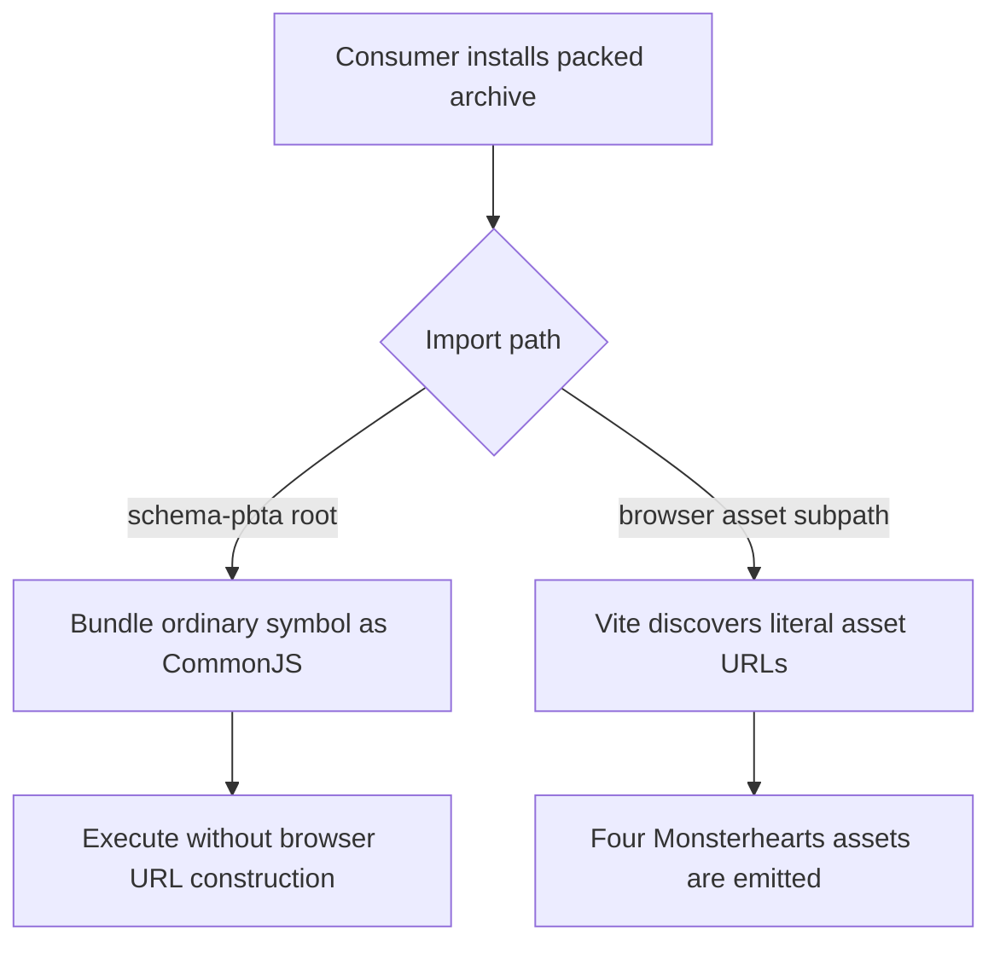
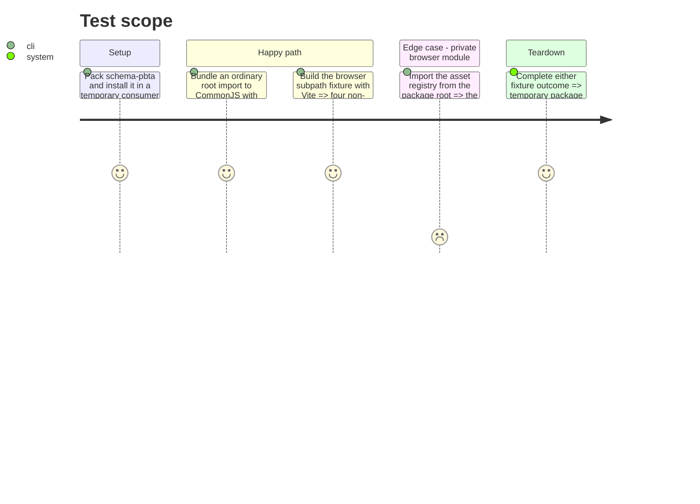

# Instruction: Isolate browser assets and prove both package formats

## Architecture projection

> Tree of the final files. ✅ create · ✏️ modify · ❌ delete

```txt
schema-pbta/
├── src/
│   ├── index.ts ✏️ stop linking the browser-only asset module from the package root
│   └── presentation/
│       └── index.ts ✏️ stop linking the browser-only asset module from the presentation aggregate
├── package.json ✏️ publish the explicit browser subpath and declare the esbuild test dependency
├── package-lock.json ✏️ lock the direct test dependency and later patch version
├── tools/
│   └── validate-package.ts ✏️ add packed CommonJS execution and retarget the packed Vite fixture
└── README.md ✏️ document safe root imports and the opt-in browser import
```

## User Journey



## Test Scope



## Tasks to do

### `1)` Publish an environment-safe export graph

> Make ordinary imports incapable of linking the module that constructs browser asset URLs.

1. Remove the asset registry's value and type re-exports from `src/index.ts` and `src/presentation/index.ts`; keep the browser module itself unchanged so Vite retains its literal static URL discovery.
2. Add a typed `./presentation/monsterhearts-appearance-assets` export-map entry that resolves directly to the built module.
3. Update the public documentation to show the explicit browser import and state that package-root imports are runtime-neutral.

### `2)` Test the packed archive in both consumer formats

> Catch package-graph failures before any candidate is staged.

1. Make esbuild a direct development dependency and extend `validate-package.ts` to bundle a minimal ordinary root import as Node/CommonJS, execute the `.cjs` output, and assert its contract value.
2. Change the existing Vite fixture to import the asset registry from the explicit subpath and retain the four-file emission, bundled URL, and no-Handbook-path assertions.
3. Assert the package root no longer exports the browser registry and the opt-in path remains resolvable only where explicitly requested.

## Test acceptance criteria

| Task | Acceptance criteria |
| --- | --- |
| 1 | Importing any ordinary root symbol does not link or evaluate `monsterhearts-appearance-assets`, while browser consumers can resolve the registry from its documented subpath with declarations. |
| 2 | The same packed archive bundles and executes through esbuild as CommonJS and emits all four Monsterhearts resources through the Vite fixture. |
