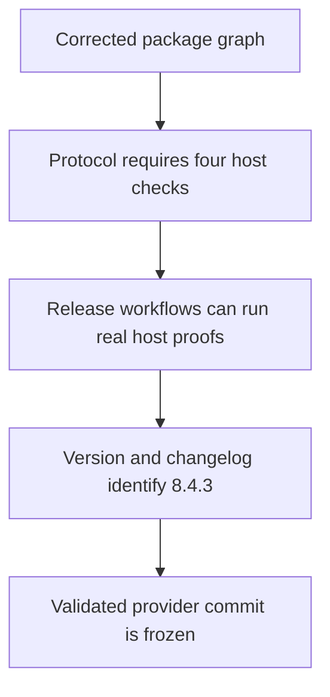
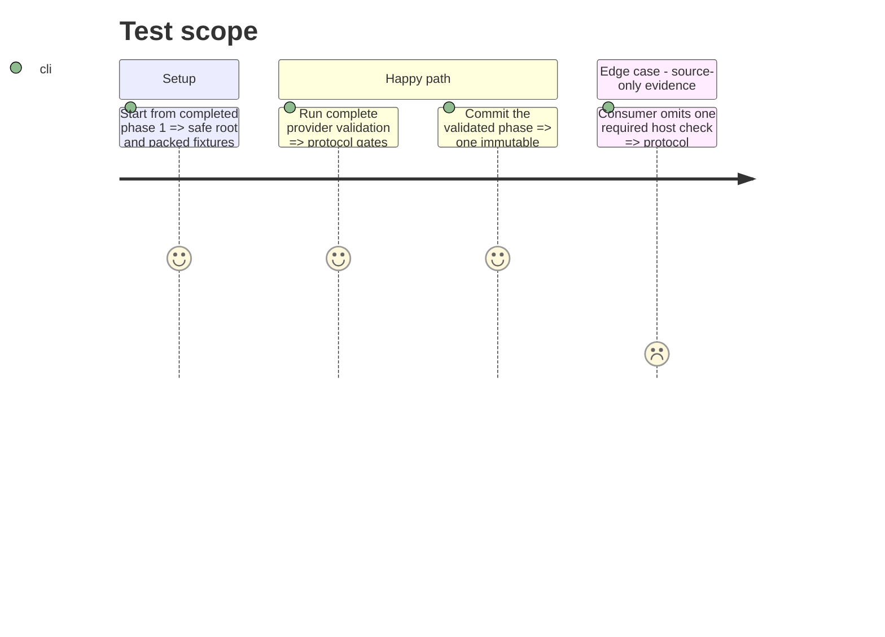

# Instruction: Define artifact gates and freeze the provider commit

## Architecture projection

> Tree of the final files. ✅ create · ✏️ modify · ❌ delete

```txt
schema-pbta/
├── .github/workflows/
│   ├── release-train.yml ✏️ provision Obsidian 1.13.7 for consumer evidence
│   └── release.yml ✏️ build staging from the recorded provider commit, provision Obsidian, and verify final bytes
├── tools/
│   ├── release-train-config.ts ✏️ require role-specific host-artifact check identifiers
│   └── validate-release-train.ts ✏️ reject missing or mislabelled artifact evidence
├── docs/compatibility.md ✏️ define the mandatory Lantern and Handbook artifact checks
├── package.json ✏️ set version 8.4.3
├── package-lock.json ✏️ synchronize version 8.4.3
└── CHANGELOG.md ✏️ record the export-boundary fix and runnable-artifact gates
```

## User Journey



## Test Scope



## Tasks to do

### `1)` Make runnable artifacts mandatory evidence

> Prevent source-level checks from satisfying a new PbtA release train.

1. Require `vite-build` and `monsterhearts-four-assets` from Lantern, and `commonjs-plugin-build` and `obsidian-1.13.7-plugin-load` from Handbook, as role-keyed subsets.
2. Add fixtures for complete evidence, missing checks, duplicates, and checks under the wrong role.
3. Provision Xvfb, Python WebSocket support, and Obsidian 1.13.7 in both workflows that execute consumer proofs.
4. Make stage mode build in an isolated checkout of `candidate.providerCommit`; make promotion download and compare the published final digest.

### `2)` Freeze the corrected provider source

> Produce the commit that the candidate tag and manifest will identify.

1. Set version 8.4.3 consistently and update the changelog and compatibility documentation.
2. Run the full provider suite, including packed CommonJS and Vite fixtures.
3. Commit the validated code and phase status; use that commit SHA as the immutable provider identity in later phases.

## Test acceptance criteria

| Task | Acceptance criteria |
| --- | --- |
| 1 | Protocol validation rejects either consumer when one of its two exact host-artifact checks is absent, and both release paths can execute Handbook in Obsidian 1.13.7. |
| 2 | Version 8.4.3 is complete and green at one immutable provider commit, before any staging manifest exists. |
