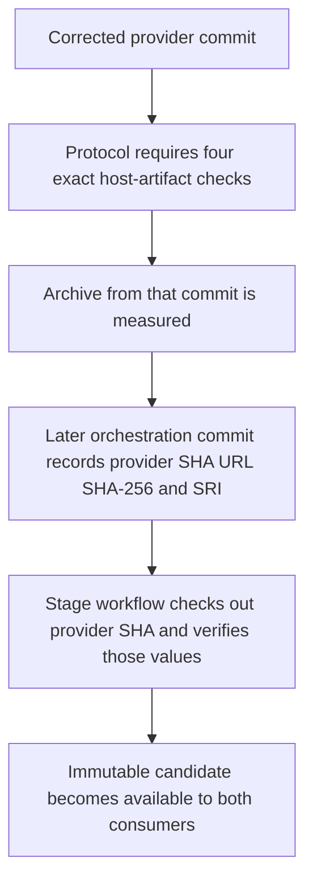
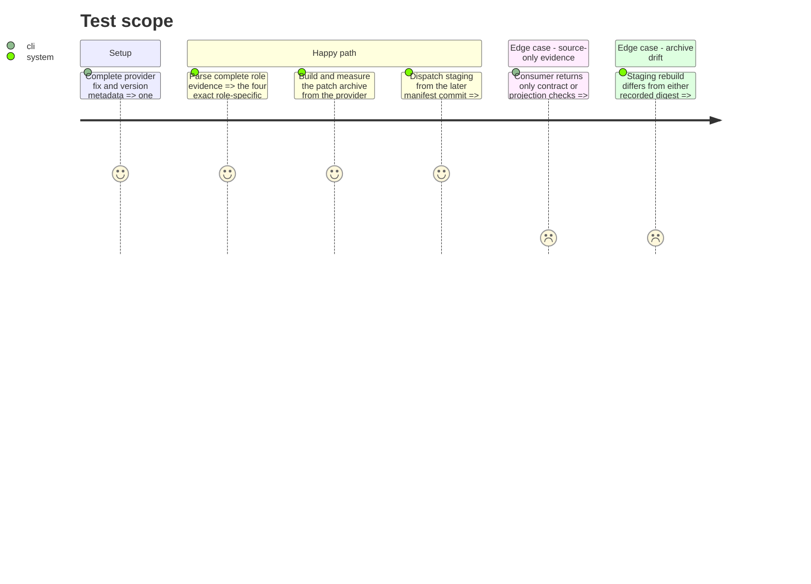

# Instruction: Define artifact gates and stage the patch candidate

## Architecture projection

> Tree of the final files. ✅ create · ✏️ modify · ❌ delete

```txt
schema-pbta/
├── .github/workflows/
│   ├── release-train.yml ✏️ provision Obsidian 1.13.7 for consumer evidence
│   └── release.yml ✏️ build staging from the recorded provider commit and provision Obsidian for promotion
├── tools/
│   ├── release-train-config.ts ✏️ require role-specific host-artifact check identifiers
│   └── validate-release-train.ts ✏️ reject missing or mislabelled artifact evidence
├── docs/compatibility.md ✏️ define the mandatory Lantern and Handbook artifact checks
├── package.json ✏️ set the patch version used by candidate and final tags
├── package-lock.json ✏️ keep the root package version synchronized
├── CHANGELOG.md ✏️ record the export-boundary fix and runnable-artifact gates
└── release-stage.schema-pbta-v8.4.3.json ✅ bind the candidate URL, digests, tags, and provider commit
```

## User Journey



## Test Scope



## Tasks to do

### `1)` Make runnable artifacts mandatory evidence

> Prevent a source-level green check from satisfying the PbtA release train.

1. Require `vite-build` and `monsterhearts-four-assets` from Lantern, and `commonjs-plugin-build` and `obsidian-1.13.7-plugin-load` from Handbook, as role-keyed subsets in the protocol-1 parser.
2. Add acceptance and rejection fixtures for complete evidence, omitted checks, duplicate or mislabelled checks, and checks supplied by the wrong role.
3. Provision Xvfb, Python WebSocket support, and the pinned Obsidian 1.13.7 AppImage in both workflows that execute consumer proofs, passing the extracted executable through the existing process environment.
4. Document the stronger evidence contract while preserving the separation from issue #40's provider-acceptance work.

### `2)` Materialize the immutable patch candidate

> Give both consumers one exact corrected archive to adopt.

1. Set version 8.4.3 consistently and update the changelog before freezing the provider commit; run the complete provider checks, including both packed-package fixtures.
2. Produce and measure the canonical Linux release archive from that commit, then add a later orchestration commit whose stage manifest records the candidate URL, SHA-256, npm SRI, staging/final tags, and earlier provider commit SHA.
3. Make `release.yml` stage mode preserve the manifest outside an isolated checkout of `candidate.providerCommit`; build and tag only that recorded source, match both digests, rerun `validate:package` on the archive, and publish the immutable candidate only on success.

## Test acceptance criteria

| Task | Acceptance criteria |
| --- | --- |
| 1 | Protocol-1 parsing rejects any Lantern evidence missing `vite-build` or `monsterhearts-four-assets`, and any Handbook evidence missing `commonjs-plugin-build` or `obsidian-1.13.7-plugin-load`. |
| 2 | The immutable v8.4.3 candidate comes from the recorded provider commit and its staged archive passes both packed fixtures with the manifest's SHA-256 and SRI. |
