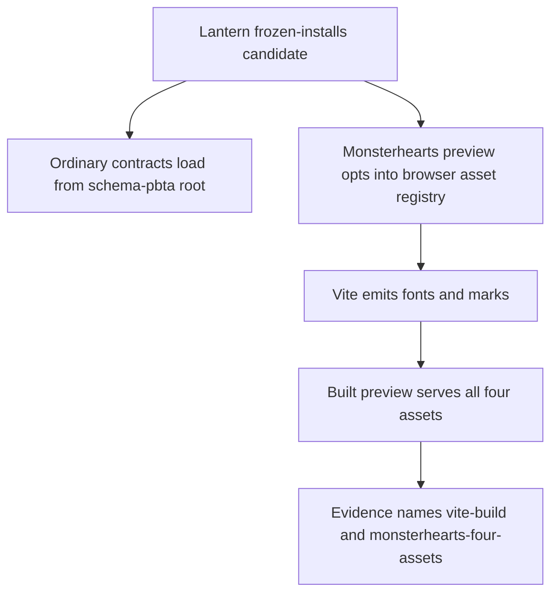
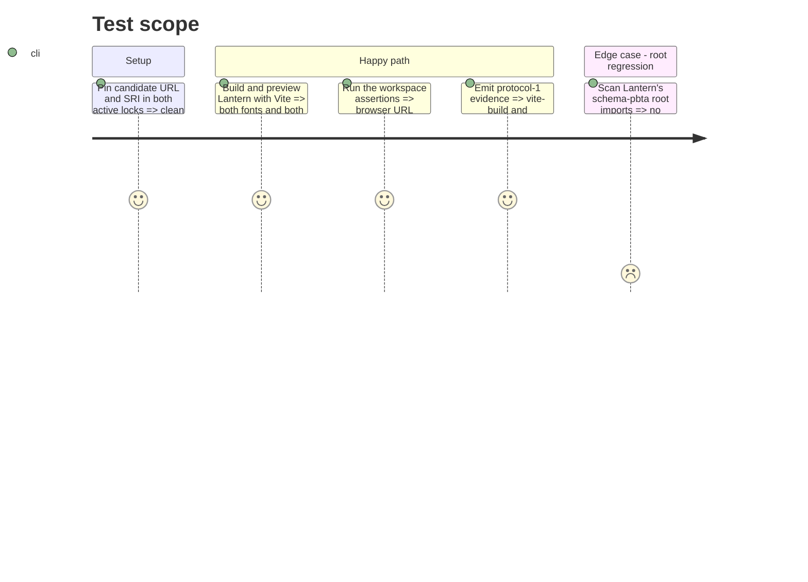

# Instruction: Move Lantern to the opt-in browser entry point

## Architecture projection

> Tree of the final files. ✅ create · ✏️ modify · ❌ delete

```txt
lantern/
├── src/templates/monsterhearts/playbook/preview/
│   └── MonsterheartsPlaybookPreview.tsx ✏️ import only the URL registry from the browser subpath
├── tools/
│   ├── assertWorkspace.harness.mts ✏️ exercise the registry through the opt-in path
│   ├── assert-template-chunks.mjs ✏️ require and HTTP-fetch both fonts and both SVGs from Vite output
│   └── release-train-assert.mjs ✏️ emit `vite-build` and `monsterhearts-four-assets`
├── package.json ✏️ adopt the staged patch archive
├── pnpm-lock.yaml ✏️ freeze the candidate URL and SRI
└── package-lock.json ✏️ freeze the same candidate URL and SRI
```

## User Journey



## Test Scope



## Tasks to do

### `1)` Adopt the explicit browser API

> Keep Lantern's browser-specific dependency visible without changing its contract imports.

1. Import `PBTA_MONSTERHEARTS_APPEARANCE_ASSET_URLS` from the new subpath in the preview and workspace harness; retain ordinary presentation and codec imports at the root.
2. Preserve the direct `?url&no-inline` asset imports used to map published identities to Vite-served URLs.
3. Pin the staged patch URL and exact SRI in `package.json`, `pnpm-lock.yaml`, and `package-lock.json`, then prove a clean frozen install.

### `2)` Strengthen the Lantern artifact proof

> Make the release journey name and verify every promised browser resource.

1. Extend the template-chunk assertion from the two SVGs to both WOFF2 fonts and both SVG marks in `dist/.vite/manifest.json` and on disk.
2. Start `vite preview` on an ephemeral loopback port, request each emitted asset URL, require a successful non-empty response, and always stop the preview process.
3. Keep the prohibition on `file:` URLs and the source assertion that Vite owns the rendered resource URLs.
4. Emit `vite-build` only after the production build passes and `monsterhearts-four-assets` only after all four manifest, disk, and HTTP assertions pass.

## Test acceptance criteria

| Task | Acceptance criteria |
| --- | --- |
| 1 | Lantern consumes the browser registry only through the opt-in export and a frozen install resolves the exact candidate bytes. |
| 2 | Lantern's candidate evidence records a passing Vite build only after both fonts and both SVG marks are emitted and fetched successfully from the production preview server. |
