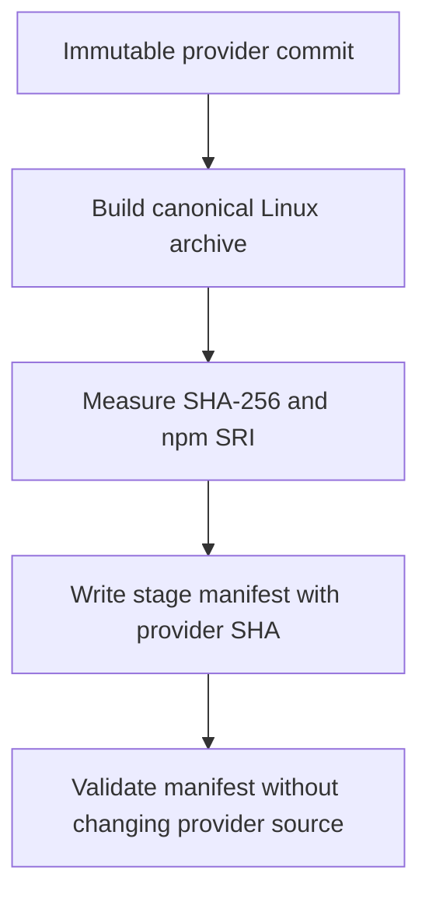
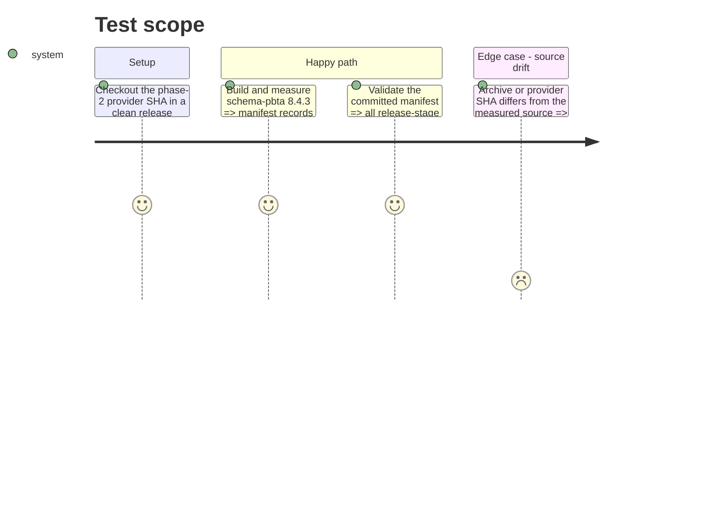

# Instruction: Record the staging manifest

## Architecture projection

> Tree of the final files. ✅ create · ✏️ modify · ❌ delete

```txt
schema-pbta/
└── release-stage.schema-pbta-v8.4.3.json ✅ bind the future candidate URL and measured archive digests to the phase-2 provider commit
```

## User Journey



## Test Scope



## Tasks to do

### `1)` Bind staging inputs to the frozen source

> Create the orchestration commit only after the provider SHA exists.

1. Build the canonical archive from the phase-2 commit under the release Node/Linux contract and calculate its SHA-256 and SHA-512 SRI.
2. Write the v8.4.3 stage manifest with the `v8.4.3-rc.1` URL, `v8.4.3` final tag, measured digests, and exact provider commit.
3. Validate the stage manifest and confirm its addition does not alter the packed payload produced from the provider commit.

## Test acceptance criteria

| Task | Acceptance criteria |
| --- | --- |
| 1 | The committed stage manifest validates and names the exact phase-2 provider SHA and canonical v8.4.3 archive digests without claiming its own orchestration commit as package source. |
