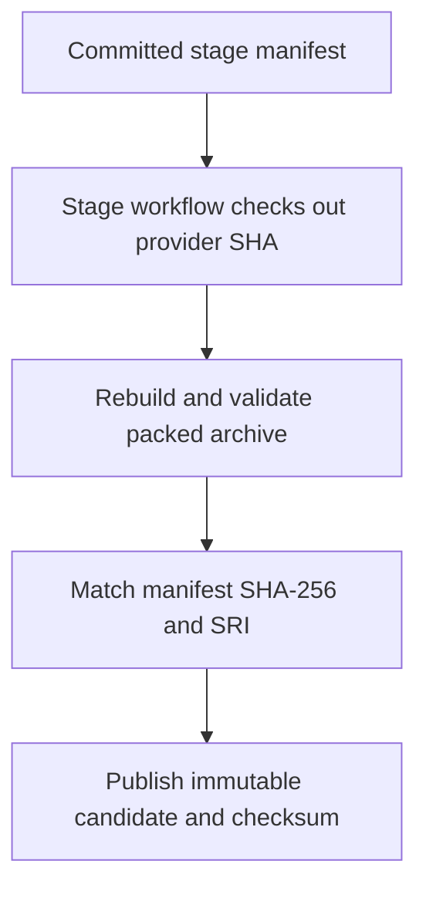
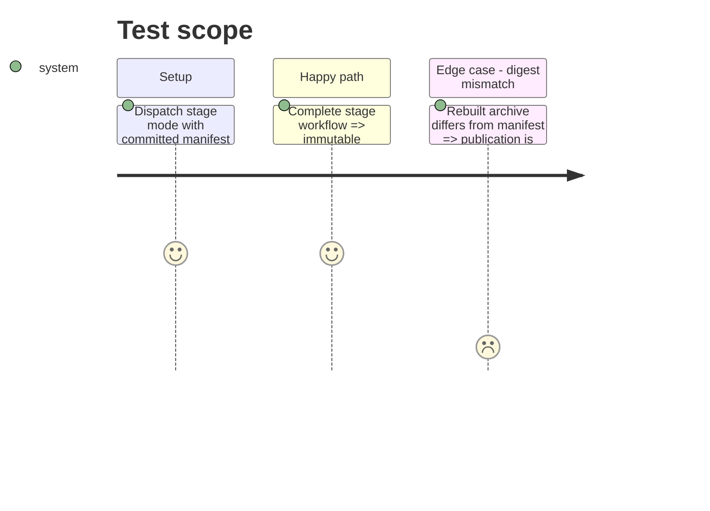

# Instruction: Publish the immutable patch candidate

## Architecture projection

> Tree of the final files. ✅ create · ✏️ modify · ❌ delete

```txt
GitHub Release v8.4.3-rc.1 ✅ immutable candidate tarball and SHA-256 sidecar targeting the recorded provider commit
```

## User Journey



## Test Scope



## Tasks to do

### `1)` Stage the proved provider bytes

> Publish the candidate only after the committed staging contract is satisfied.

1. Push the provider and manifest commits, then dispatch `release.yml` in stage mode with the recorded inputs.
2. Wait for the workflow to pass and verify the prerelease is immutable, targets the provider commit, and carries exactly the v8.4.3 tarball and checksum.
3. Record the reachable candidate URL and digests for both consumer adoption branches.

## Test acceptance criteria

| Task | Acceptance criteria |
| --- | --- |
| 1 | The immutable v8.4.3-rc.1 release targets the phase-2 provider commit and publishes the exact manifest-matching archive and checksum. |
