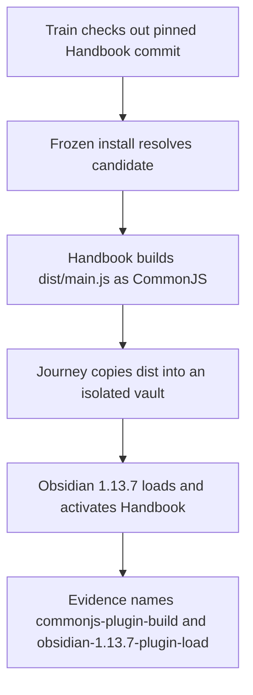
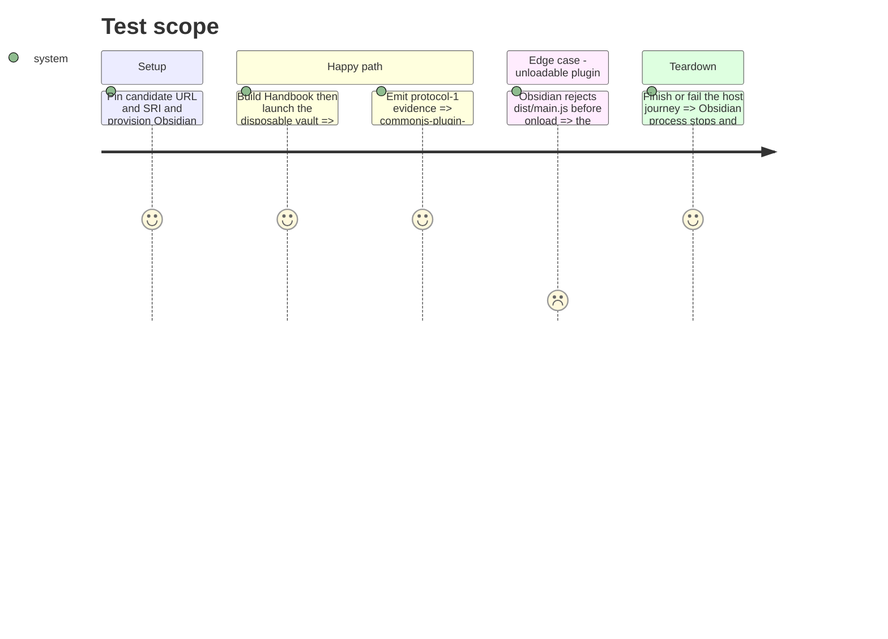

# Instruction: Make Handbook's built-plugin load part of release evidence

## Architecture projection

> Tree of the final files. ✅ create · ✏️ modify · ❌ delete

```txt
obsidian-handbook/
├── tools/
│   ├── e2e/
│   │   ├── plugin-load-journey.sh ✅ launch the built plugin in an isolated Obsidian profile and vault
│   │   ├── plugin-load-cdp.py ✅ assert Handbook activates without a module-evaluation error
│   │   └── README.md ✏️ document the focused load journey and prerequisites
│   ├── prove-built-plugin.mjs ✅ expose one shared production build/load proof
│   ├── release-train-assert.mjs ✏️ require the shared proof around every provider-specific assertion
│   ├── release-train-schema-pbta-assert.mjs ✏️ merge exact host checks into PbtA evidence
│   ├── release-train-schema-adrenaline-assert.mjs ✏️ merge the same host checks without changing provider acceptance
│   ├── assert-release-train-schema-pbta.mjs ✏️ test PbtA evidence hermetically
│   └── assert-release-train-schema-adrenaline.mjs ✏️ preserve Adrenaline dispatch coverage with the shared host gate
├── package.json ✏️ expose the focused journey and adopt the staged patch archive
└── pnpm-lock.yaml ✏️ freeze the candidate URL and SRI
```

## User Journey



## Test Scope



## Tasks to do

### `1)` Add a focused real-host load journey

> Prove the generated plugin artifact reaches `onload()` in the supported Obsidian runtime.

1. Build Handbook, copy `dist/main.js`, `dist/manifest.json`, and `dist/styles.css` into a newly created vault, enable only `obsidian-handbook`, and launch an isolated Obsidian 1.13.7 profile under CDP.
2. Wait for the matching vault, assert the plugin is both enabled and present in `app.plugins.plugins`, and surface promise rejections or activation errors as a failed journey.
3. Reuse the repository's AppImage/CDP conventions, require a caller-supplied executable, and clean the process, vault, and profile on every exit.

### `2)` Bind the Handbook artifact to every protocol-1 evidence path

> Make the real host load a prerequisite of the consumer's passing result.

1. Pin the staged patch URL and SRI in Handbook's active manifest and pnpm lock, then prove a frozen install resolves that exact archive.
2. Put the production build and focused Obsidian journey in a shared proof invoked by the main release-train dispatcher after the selected provider-specific contract assertions and before evidence is committed.
3. Emit `commonjs-plugin-build` only after the production build and `obsidian-1.13.7-plugin-load` only after the real host journey; every production CLI dispatch uses those real dependencies and exposes no skip flag.
4. Keep provider recognition, URL rules, and contract journeys provider-owned: reuse the host checks in the existing PbtA and Adrenaline evidence paths without implementing #40's provider-generalization work here.
5. Inject runners only at the exported orchestration boundary so the PbtA and Adrenaline harnesses can test success, failure, and omitted evidence during ordinary `pnpm check` without launching Obsidian.

## Test acceptance criteria

| Task | Acceptance criteria |
| --- | --- |
| 1 | A production Handbook build consuming the candidate activates successfully in a fresh isolated Obsidian 1.13.7 vault, and the same journey fails on a module-evaluation rejection. |
| 2 | Every supported Handbook candidate proof records `commonjs-plugin-build` and `obsidian-1.13.7-plugin-load` from the real production path, while ordinary harnesses remain hermetic and cannot bypass the CLI's host gate. |
