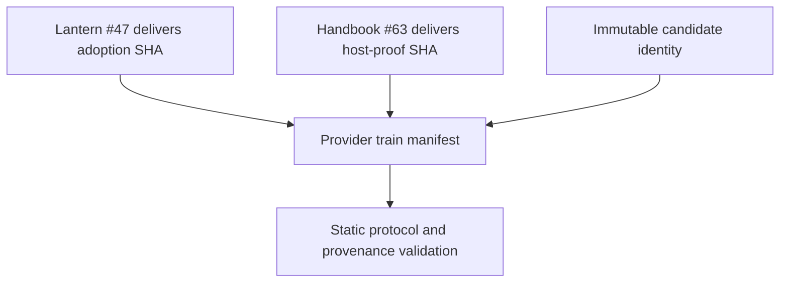
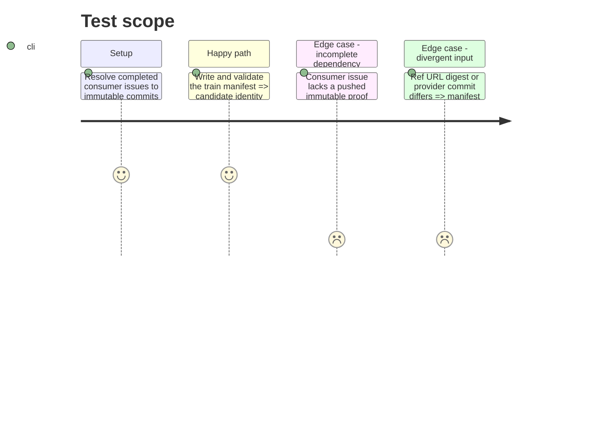

# Instruction: Freeze externally delivered consumer proofs

## Architecture projection

> Tree of the final files. ✅ create · ✏️ modify · ❌ delete

```txt
schema-pbta/
└── release-train/schema-pbta-v8.4.3.json ✅ bind the staged candidate to immutable consumer commits delivered by Lantern #47 and Handbook #63
```

## User Journey



## Test Scope



## Tasks to do

### `1)` Consume immutable external delivery

> Coordinate the train without modifying either consumer repository.

1. Confirm Lantern #47 has delivered a pushed commit that adopts the candidate and implements `vite-build` plus `monsterhearts-four-assets`.
2. Confirm Handbook #63 has delivered a pushed commit that builds the CommonJS plugin and implements `commonjs-plugin-build` plus `obsidian-1.13.7-plugin-load`.
3. Copy the staged candidate identity exactly and add both full consumer SHAs with canonical repository identities and proof interfaces.
4. Validate candidate URL and digests, provider ancestry, distinct consumer repositories, full SHAs, and supported proof interfaces before committing the manifest.

## Test acceptance criteria

| Task | Acceptance criteria |
| --- | --- |
| 1 | The committed v8.4.3 train manifest references the exact immutable candidate plus one pushed delivery commit from Lantern #47 and one from Handbook #63, without changing either consumer repository. |
