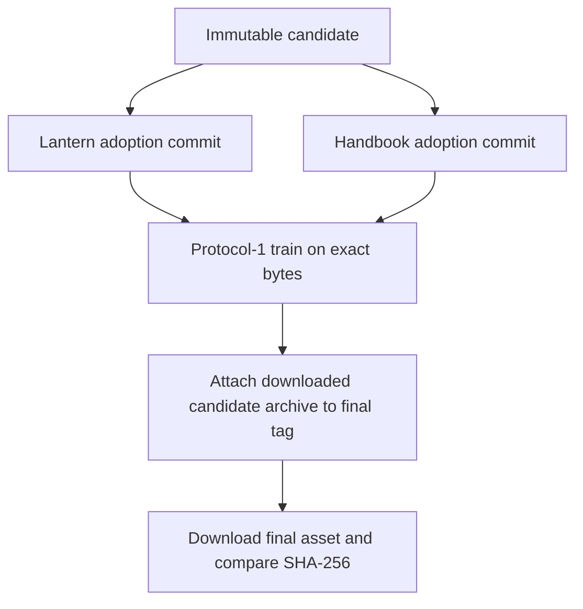
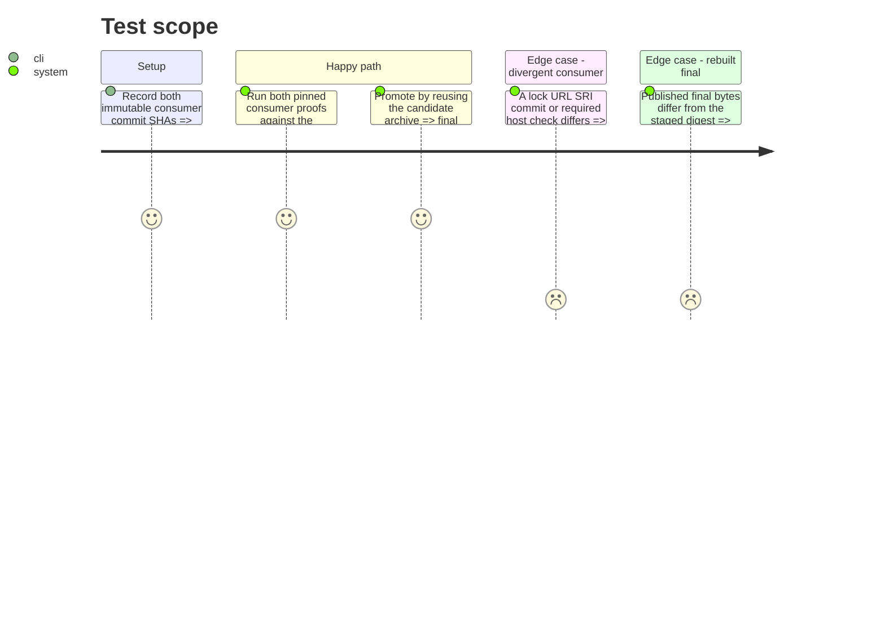

# Instruction: Prove and promote the byte-identical patch

## Architecture projection

> Tree of the final files. ✅ create · ✏️ modify · ❌ delete

```txt
schema-pbta/
├── release-train/
│   └── schema-pbta-v8.4.3.json ✅ pin the candidate and proved Lantern and Handbook adoption commits
└── .github/workflows/
    └── release.yml ✏️ compare the published final asset digest with the candidate digest
```

## User Journey



## Test Scope



## Tasks to do

### `1)` Freeze and run the convergent train

> Bind both consumer-owned proofs to the same candidate archive.

1. Record the full Lantern and Handbook adoption commit SHAs beside the already staged candidate identity in a new immutable release-train manifest.
2. Run the train from the recorded provider commit and retain provenance containing `vite-build`, `monsterhearts-four-assets`, `commonjs-plugin-build`, and `obsidian-1.13.7-plugin-load` under their owning consumers.
3. Treat any candidate, lock, consumer-ref, required-check, build, host-load, or repository-cleanliness mismatch as a promotion blocker.

### `2)` Promote without rebuilding

> Make the stable asset exactly the artifact tested by both applications.

1. Download the SHA-verified candidate archive after the convergent train passes and attach that file, without invoking `npm pack`, to the final v8.4.3 tag on the recorded provider commit.
2. Download the published final asset and compare its SHA-256 with the candidate manifest before reporting the workflow successful.
3. Record the train run, final release, matching digest, and explicit host-artifact checks before closing issue #41.

## Test acceptance criteria

| Task | Acceptance criteria |
| --- | --- |
| 1 | The pinned Lantern and Handbook commits prove the same staged archive and the retained provenance names every mandatory host-artifact check. |
| 2 | The final v8.4.3 archive is the candidate file, its downloaded SHA-256 equals the staged SHA-256, and #41 closes only after that equality is recorded. |
