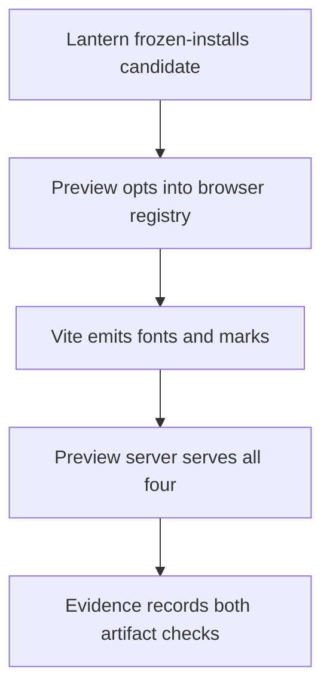
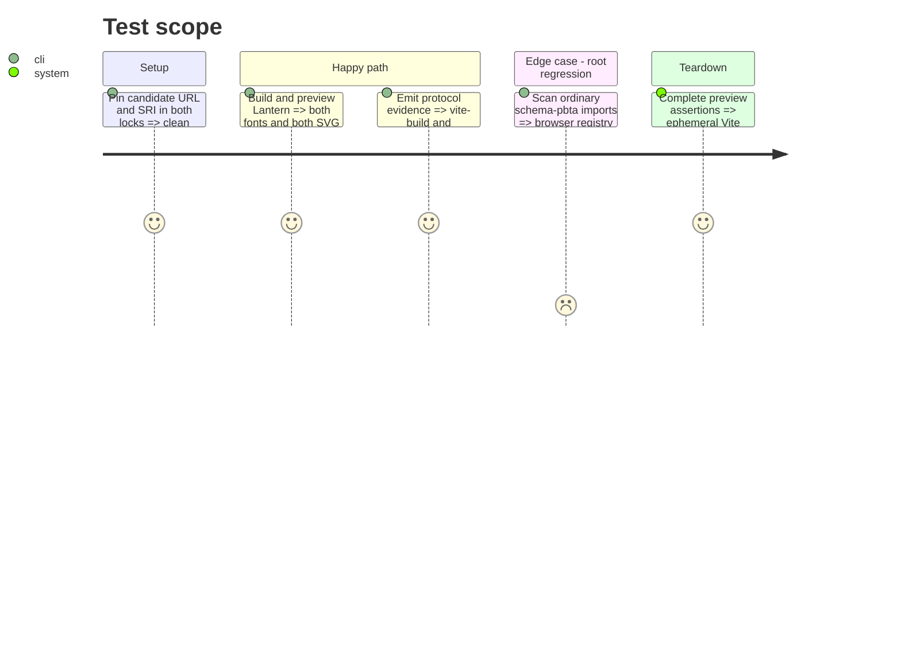

# Instruction: Move Lantern to the opt-in browser entry point

## Architecture projection

> Tree of the final files. ✅ create · ✏️ modify · ❌ delete

```txt
lantern/
├── src/templates/monsterhearts/playbook/preview/MonsterheartsPlaybookPreview.tsx ✏️ import the URL registry from the browser subpath
├── tools/
│   ├── assertWorkspace.harness.mts ✏️ exercise the opt-in registry
│   ├── assert-template-chunks.mjs ✏️ emit and HTTP-fetch both fonts and both SVGs
│   └── release-train-assert.mjs ✏️ emit `vite-build` and `monsterhearts-four-assets`
├── package.json ✏️ adopt the staged patch archive
├── pnpm-lock.yaml ✏️ freeze candidate URL and SRI
└── package-lock.json ✏️ freeze the same candidate URL and SRI
```

## User Journey



## Test Scope



## Tasks to do

### `1)` Adopt and prove the browser API

> Keep Lantern browser semantics explicit and observable in its production artifact.

1. Move registry imports to the new subpath while retaining ordinary contract imports at the root and direct `?url&no-inline` mappings.
2. Extend the built-output assertion to both WOFF2 fonts and both SVGs, then serve and fetch all four from an ephemeral Vite preview.
3. Emit the two exact check identifiers only after their corresponding build and four-asset assertions pass.
4. Pin the candidate URL/SRI in both locks, run the clean frozen-install proof, and commit the Lantern adoption branch.

## Test acceptance criteria

| Task | Acceptance criteria |
| --- | --- |
| 1 | Lantern consumes the opt-in path, emits and serves all four assets, and its candidate evidence names both required checks against the exact staged bytes. |
