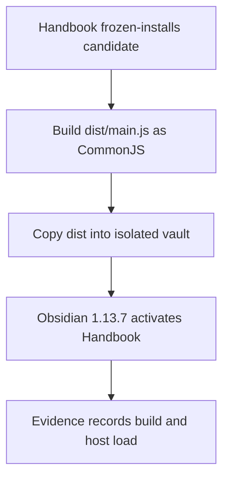
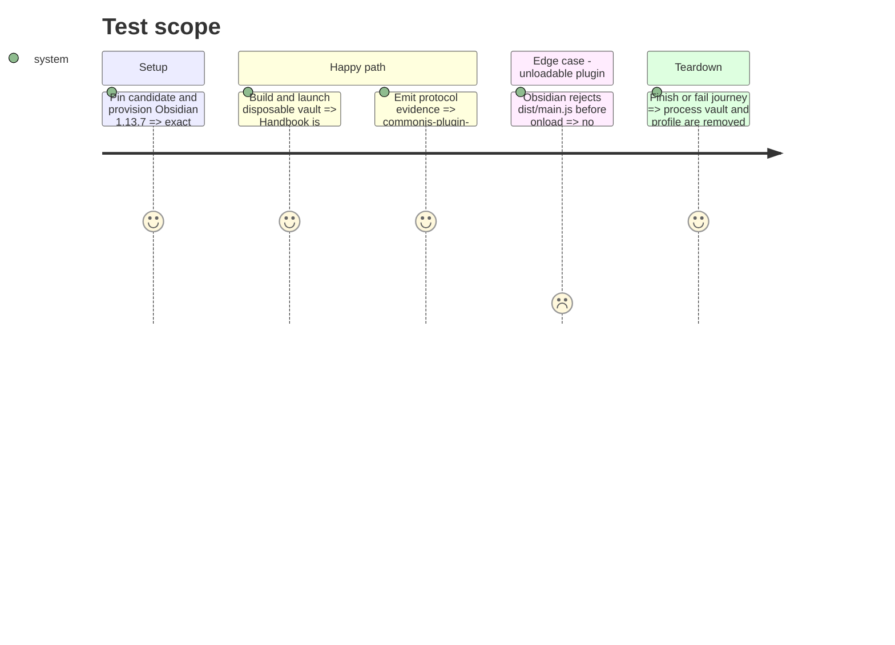

# Instruction: Make Handbook's built-plugin load part of release evidence

## Architecture projection

> Tree of the final files. ✅ create · ✏️ modify · ❌ delete

```txt
obsidian-handbook/
├── tools/e2e/
│   ├── plugin-load-journey.sh ✅ launch an isolated Obsidian profile and vault
│   ├── plugin-load-cdp.py ✅ assert Handbook activates without module-evaluation errors
│   └── README.md ✏️ document the focused journey
├── tools/
│   ├── prove-built-plugin.mjs ✅ expose one shared production build/load proof
│   ├── release-train-assert.mjs ✏️ require it around every provider assertion
│   ├── release-train-schema-pbta-assert.mjs ✏️ merge exact host checks into evidence
│   ├── release-train-schema-adrenaline-assert.mjs ✏️ reuse the gate without broadening provider acceptance
│   ├── assert-release-train-schema-pbta.mjs ✏️ test the adapter hermetically
│   └── assert-release-train-schema-adrenaline.mjs ✏️ retain dispatcher coverage
├── package.json ✏️ expose the focused journey and adopt the candidate
└── pnpm-lock.yaml ✏️ freeze candidate URL and SRI
```

## User Journey



## Test Scope



## Tasks to do

### `1)` Add the focused real-host journey

> Prove the generated plugin reaches `onload()` in Obsidian 1.13.7.

1. Build Handbook, copy its three distribution files into a new vault, enable only Handbook, and launch an isolated profile under CDP.
2. Assert the matching vault and loaded plugin identity, surface activation rejections, and clean all temporary state on every exit.

### `2)` Bind the host artifact to evidence

> Apply the load gate to the complete Handbook artifact independently of candidate provider.

1. Run one shared build/load proof after provider-specific assertions and before evidence is committed.
2. Keep the production CLI fail-closed with no skip flag; inject runners only into exported orchestration for hermetic harnesses.
3. Pin the PbtA candidate URL/SRI, prove the frozen install, and commit the Handbook adoption branch while preserving the existing diagnosis file.

## Test acceptance criteria

| Task | Acceptance criteria |
| --- | --- |
| 1 | A production Handbook build consuming the candidate activates in a fresh isolated Obsidian 1.13.7 vault and fails visibly on module evaluation errors. |
| 2 | Every supported Handbook proof records `commonjs-plugin-build` and `obsidian-1.13.7-plugin-load` from the real CLI path. |
