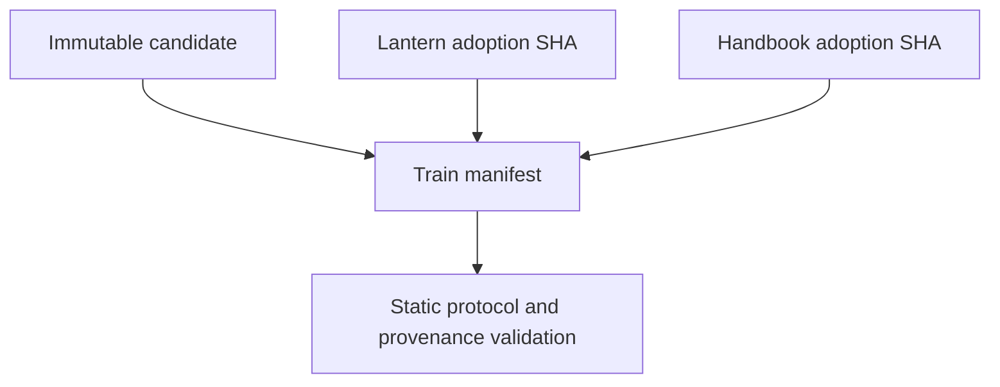
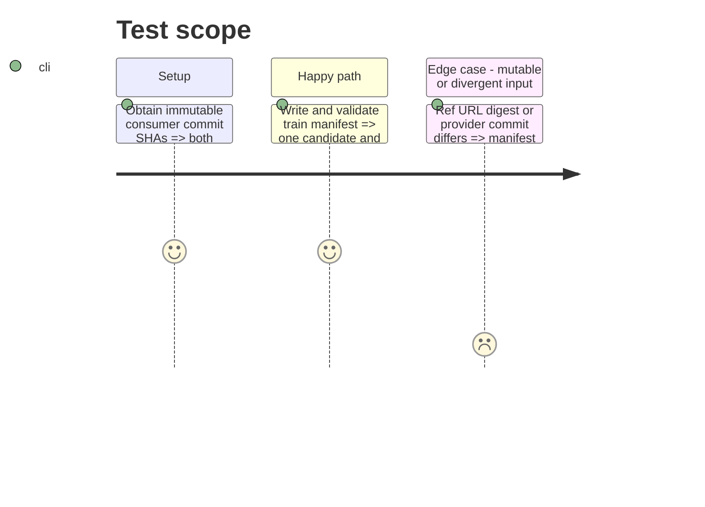

# Instruction: Freeze the convergent release train

## Architecture projection

> Tree of the final files. ✅ create · ✏️ modify · ❌ delete

```txt
schema-pbta/
└── release-train/schema-pbta-v8.4.3.json ✅ bind candidate identity plus full Lantern and Handbook adoption SHAs
```

## User Journey



## Test Scope



## Tasks to do

### `1)` Commit the immutable train input

> Make the later evidence run refer only to already-existing commits and bytes.

1. Copy the staged candidate identity exactly and add the full Lantern and Handbook adoption SHAs with canonical repository identities and proof paths.
2. Validate the manifest, candidate URL/digests, provider ancestry, distinct consumer workspaces, and supported proof interface.
3. Commit the manifest before dispatching either train or promotion.

## Test acceptance criteria

| Task | Acceptance criteria |
| --- | --- |
| 1 | The committed v8.4.3 train manifest validates and names one immutable candidate plus the exact two consumer adoption commits. |
