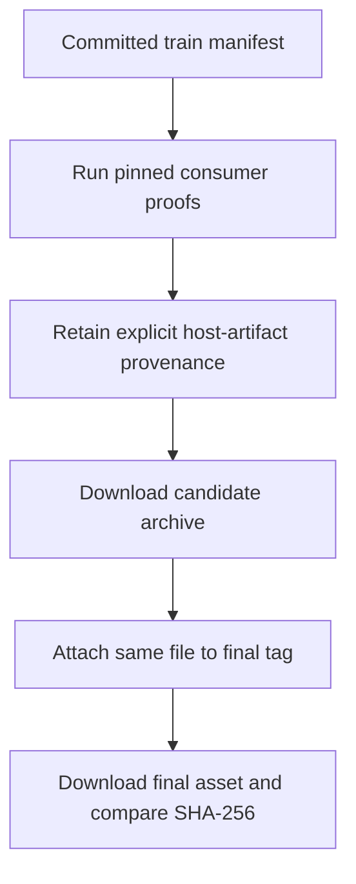
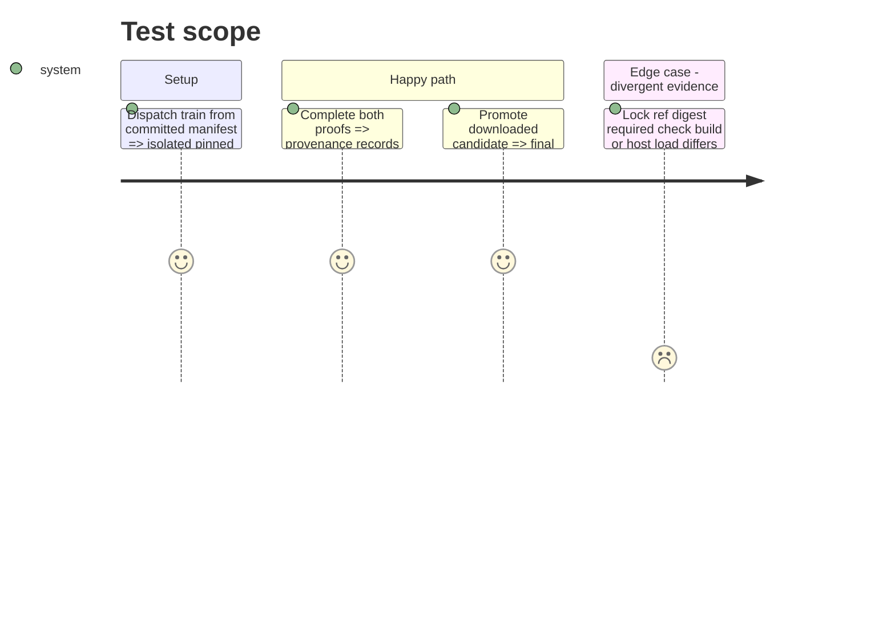

# Instruction: Prove and promote the byte-identical patch

## Architecture projection

> Tree of the final files. ✅ create · ✏️ modify · ❌ delete

```txt
GitHub Actions release-train provenance ✅ records both consumers and four host-artifact checks
GitHub Release v8.4.3 ✅ reuses candidate tarball and checksum on the provider commit
GitHub issue #41 ✏️ closes with train, release, and matching-digest evidence
```

## User Journey



## Test Scope



## Tasks to do

### `1)` Run the convergent train

> Require both applications to prove the exact staged archive.

1. Dispatch the train with the committed manifest and provider SHA, wait for both frozen consumer proofs, and retain its provenance artifact.
2. Confirm Lantern reports `vite-build` and `monsterhearts-four-assets`, while Handbook reports `commonjs-plugin-build` and `obsidian-1.13.7-plugin-load`.

### `2)` Promote without rebuilding

> Make the final release byte-identical to the candidate both consumers executed.

1. Dispatch promotion only after the train passes; download and reuse the candidate archive without invoking `npm pack`.
2. Verify the final immutable release targets the provider commit and its downloaded archive SHA-256 equals the staged digest.
3. Record the train run, release, and matching digest on issue #41, then close it.

## Test acceptance criteria

| Task | Acceptance criteria |
| --- | --- |
| 1 | Retained provenance names both pinned consumers and all four mandatory host-artifact checks for the same candidate. |
| 2 | The final v8.4.3 archive SHA-256 equals the candidate SHA-256 and issue #41 closes only after that equality is recorded. |
