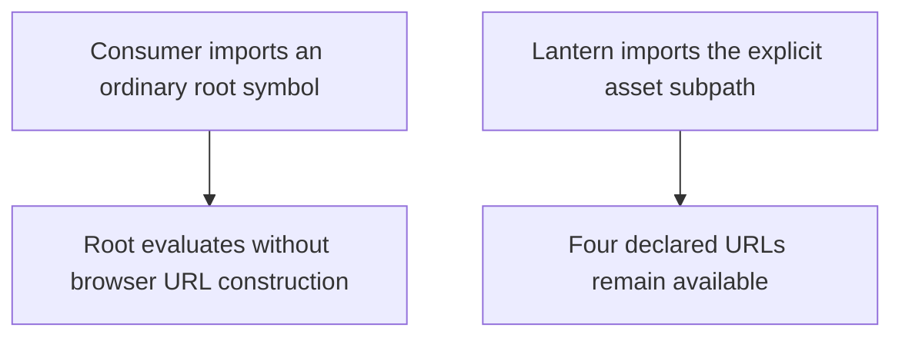
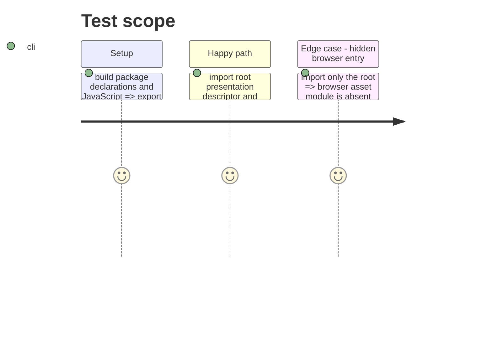

# Instruction: Isolate the browser asset API

## Architecture projection

> Tree of the final files. ✅ create · ✏️ modify · ❌ delete

```txt
.
├── src/index.ts ✏️ remove the runtime asset URL re-export from the package root
├── src/presentation/index.ts ✏️ remove the runtime asset URL re-export from the presentation barrel
├── package.json ✏️ add the explicit browser subpath export with matching types and import targets
├── README.md ✏️ document the browser subpath and portable appearance descriptor
└── ❌ none — no schema, descriptor, or asset files change
```

## User Journey



## Test Scope



## Tasks to do

### `1)` Separate the public entries

> Make the root safe for non-Vite bundlers while keeping the browser API available.

1. Remove runtime asset URL exports from both barrels; keep portable appearance values and types where useful.
2. Export the existing asset module through an explicit `package.json` subpath with its generated declaration target.
3. Preserve literal `new URL(..., import.meta.url)` expressions and all four assets in that module without changing its resource semantics.

### `2)` Explain consumer imports

> Make the opt-in boundary clear to Lantern and other callers.

1. Update README examples to use the explicit browser subpath.
2. State that package-root appearance metadata retains package-relative resource paths for non-browser consumers.

## Test acceptance criteria

| Task | Acceptance criteria |
| --- | --- |
| 1 | Ordinary root imports cannot evaluate the asset URL module; the explicit subpath resolves the same four browser resources and types. |
| 2 | README import examples resolve through the published export map and distinguish the descriptor from browser URLs. |
