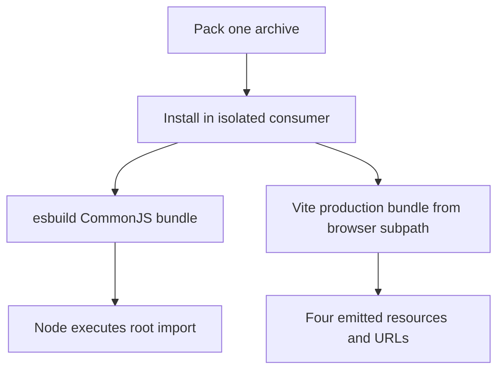
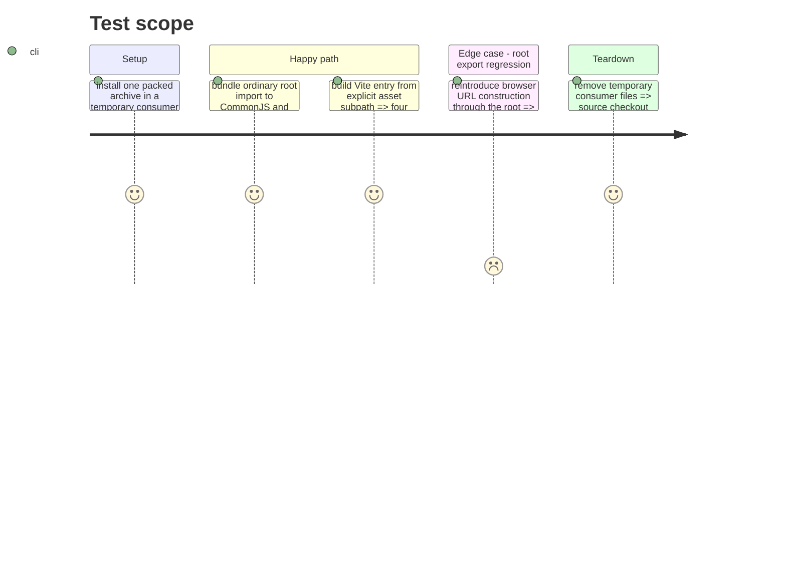

# Instruction: Verify both packed consumer formats

## Architecture projection

> Tree of the final files. ✅ create · ✏️ modify · ❌ delete

```txt
.
├── tools/validate-package.ts ✏️ install one tarball, bundle and execute a CommonJS root fixture, and retain the Vite asset fixture through the new subpath
├── package.json ✏️ add a direct esbuild development dependency for the fixture
├── package-lock.json ✏️ lock that fixture dependency
└── ❌ none — fixtures can remain temporary files created by the validator
```

## User Journey



## Test Scope



## Tasks to do

### `1)` Add the packed CommonJS execution fixture

> Reproduce Handbook's bundling boundary from the installed archive.

1. Use a direct esbuild dependency and bundle an ordinary `schema-pbta` root symbol with CommonJS output for Node, matching Handbook's relevant bundling settings and retaining root-module evaluation.
2. Before the export change, demonstrate that the fixture fails on the v8.4.2 archive with the reported URL error; then execute the patched bundle and assert the imported symbol's expected value.
3. Keep the fixture scoped to the installed tarball, including when a supplied candidate archive is passed to `validate:package`.

### `2)` Retain the Vite proof

> Show that the opt-in path still emits the actual resources.

1. Change the Vite fixture import to `schema-pbta/presentation/monsterhearts-appearance-assets`.
2. Assert four emitted `.woff2` and `.svg` resources and bundled URLs from the installed archive.

## Test acceptance criteria

| Task | Acceptance criteria |
| --- | --- |
| 1 | The v8.4.2 archive reproduces the URL failure in the fixture, while the patched archive's root symbol bundles through esbuild as CommonJS and executes under Node. |
| 2 | The same packed archive passes a Vite build that emits and references all four Monsterhearts assets. |
