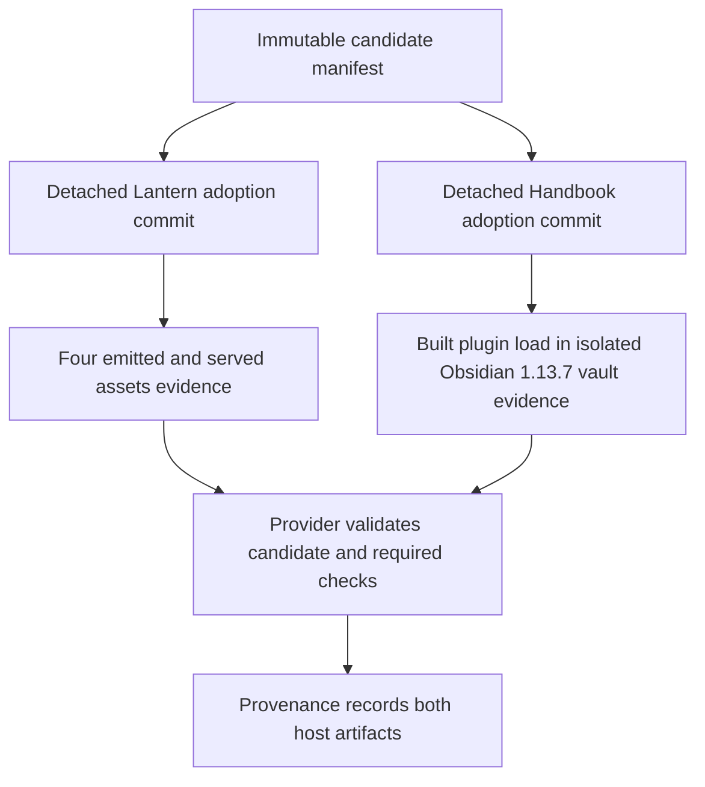
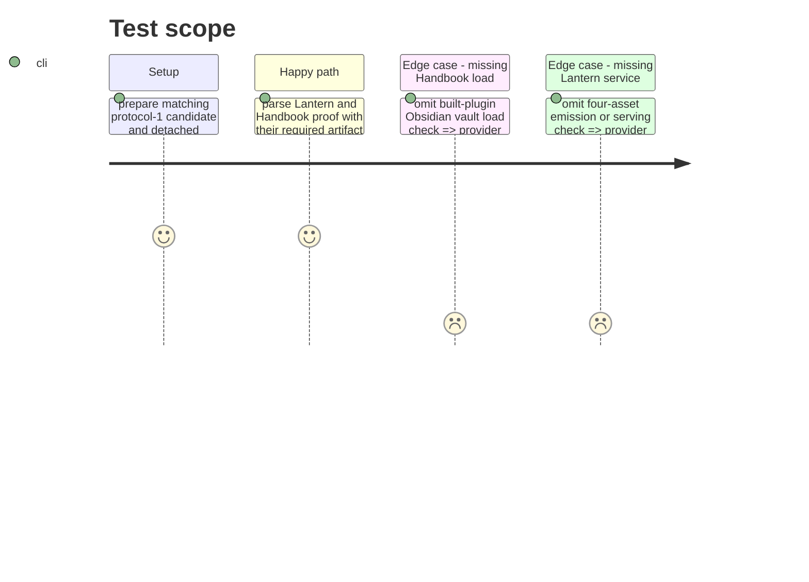

# Instruction: Require host artifact evidence

## Architecture projection

> Tree of the final files. ✅ create · ✏️ modify · ❌ delete

```txt
.
├── tools/release-train-config.ts ✏️ require role-specific artifact checks in protocol-1 evidence
├── tools/validate-release-train.ts ✏️ add passing and missing-check evidence fixtures for both roles
├── README.md ✏️ document each consumer's required artifact proof and immutable ref
└── ❌ none — Lantern #47 and Handbook #63 own their build and load implementations
```

## User Journey



## Test Scope



## Tasks to do

### `1)` Make artifact checks mandatory

> Prevent source-only proof from satisfying the release train.

1. Require Lantern's declared `vite-build` and `monsterhearts-four-assets` identifiers; set `production-build` and `obsidian-plugin-load` as the Handbook evidence identifiers and coordinate those names with Handbook #63 before its adoption commit.
2. Require Lantern evidence for Vite emission and serving of all four assets, and Handbook evidence for a built-plugin load in an isolated Obsidian 1.13.7 vault.
3. Reject missing or duplicate mandatory check identifiers while retaining candidate, lock, and immutable-commit validation.

### `2)` Record and explain the results

> Keep the exact checked artifact visible in final train provenance.

1. Extend release-train validation fixtures with positive and negative role-specific evidence cases.
2. Verify the existing train provenance records each accepted check list, and describe the gate in README.

## Test acceptance criteria

| Task | Acceptance criteria |
| --- | --- |
| 1 | A passed consumer assertion lacking its mandatory host-artifact check cannot authorize promotion. |
| 2 | Provenance names Lantern's four-asset result and Handbook's Obsidian 1.13.7 built-plugin load for the exact candidate and adoption commits. |
