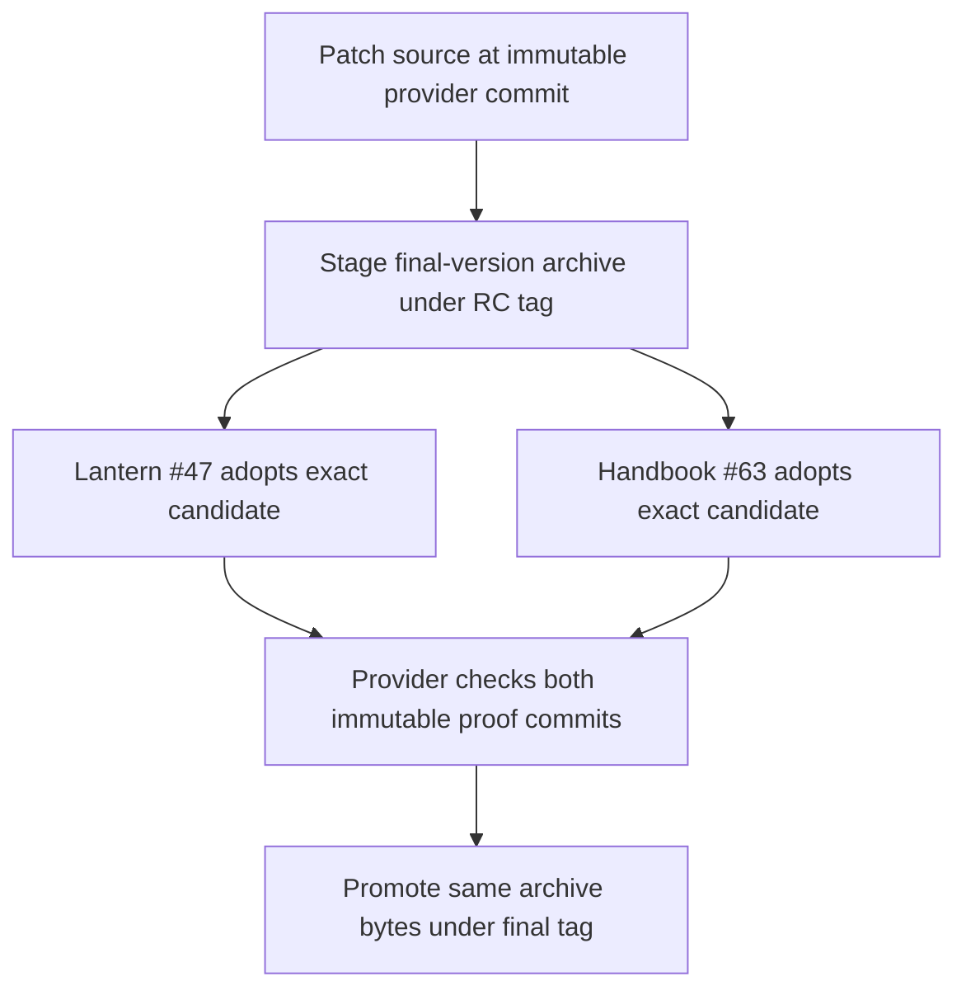
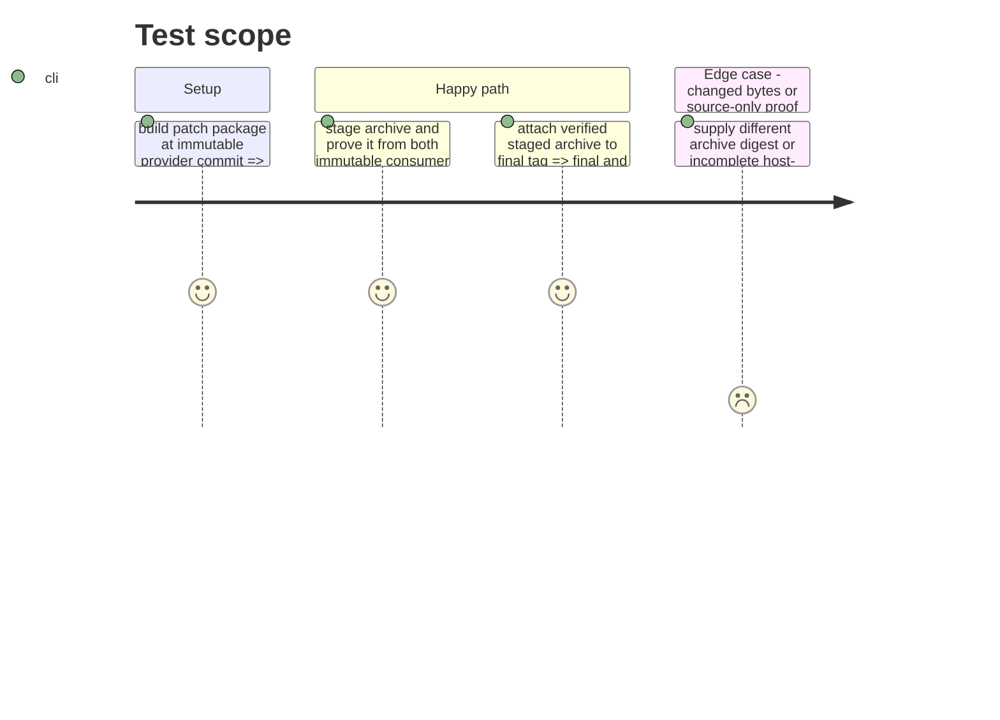

# Instruction: Stage and promote the patch bytes

## Architecture projection

> Tree of the final files. ✅ create · ✏️ modify · ❌ delete

```txt
.
├── package.json ✏️ advance to a fresh patch version
├── package-lock.json ✏️ mirror the patch version and dependency lock
├── CHANGELOG.md ✏️ record the root export fix and artifact gate
├── .github/workflows/release.yml ✏️ build the staged archive from the exact provider commit and keep promotion on verified staged bytes
├── .github/workflows/publish-candidate.yml ✏️ require packed CommonJS and Vite validation before its alternate RC publication path
├── tools/validate-release-train.ts ✏️ reject a final train whose candidate identity differs from the staged patch record
├── release-stage.schema-pbta-v8.4.3.json ✅ record the new candidate identity after archive creation
├── release-train/schema-pbta-v8.4.3.json ✅ record the exact archive and both immutable adoption commits
├── release-train/candidates/schema-pbta-v8.4.3-rc.1.json ✅ retain immutable candidate provenance if the existing candidate record convention applies
└── ❌ none — the v8.4.2 records and published assets stay immutable
```

## User Journey



## Test Scope



## Tasks to do

### `1)` Prepare a fresh patch candidate

> Give consumers one immutable archive to adopt.

1. Advance package and lock versions, record the fix, run the full project check and packed archive validator.
2. Make `release.yml` staging require its `provider_commit` input to equal `candidate.providerCommit`, then check out and build the package from that exact commit in a separate directory; target the RC tag at the same commit even when the manifest is committed later.
3. Use `release.yml` staging on its Ubuntu/Node 24 runner as the canonical v8.4.3 route; require `validate:package` on the exact archive in both that route and the still-available `publish-candidate.yml` path.
4. Record the patch candidate's provider commit, URL, SHA-256, SRI, staging tag, and final tag from a build in the canonical environment; stage only after that archive's checks pass.

### `2)` Collect consumer-owned adoption evidence

> Wait for Lantern #47 and Handbook #63 to prove the staged bytes at full commits.

1. Register their immutable adoption SHAs in the final train manifest after each repository has published its proof.
2. For a real patch train manifest, verify its candidate fields match the staged patch record exactly, including URL, SHA-256, SRI, version, tags, and provider commit; keep the synthetic `cross-tool.release-train.fixture.json` independent of real stage records.
3. Run the provider train and retain provenance showing candidate identity plus both mandatory artifact checks.

### `3)` Promote the same bytes

> Attach the verified candidate archive under the final version.

1. Use the existing promotion workflow only after both proofs pass.
2. Re-download the final GitHub release asset after upload, compare its SHA-256 with the candidate archive, and record the equality in release evidence.

## Test acceptance criteria

| Task | Acceptance criteria |
| --- | --- |
| 1 | A new patch candidate is staged under an unused immutable RC tag from the exact provider commit after CommonJS and Vite checks pass on that archive, regardless of publication workflow. |
| 2 | Lantern and Handbook evidence from immutable commits names the exact candidate, matches the staged record, and includes their required host-artifact checks. |
| 3 | A freshly downloaded final release asset has the exact staged SHA-256, with explicit artifact checks in release-train provenance. |
