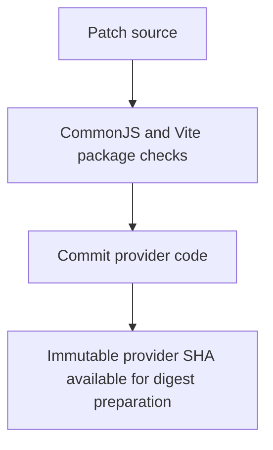
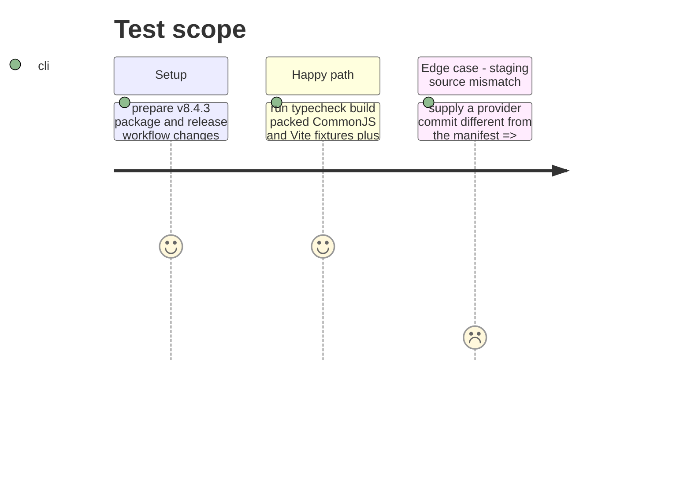

# Instruction: Prepare the patch provider commit

## Architecture projection

> Tree of the final files. ✅ create · ✏️ modify · ❌ delete

```txt
.
├── package.json ✏️ advance to 8.4.3
├── package-lock.json ✏️ mirror the patch version and dependency lock
├── CHANGELOG.md ✏️ record the root export fix and artifact gate
├── .github/workflows/release.yml ✏️ add a non-publishing digest mode, build staging from the exact provider commit, and verify uploaded final bytes
├── .github/workflows/publish-candidate.yml ✏️ validate the packed archive before its alternate RC publication path
├── tools/validate-release-train.ts ✏️ reject a real train candidate that differs from its staged patch record
└── ❌ none — v8.4.2 source and release records stay immutable
```

## User Journey



## Test Scope



## Tasks to do

### `1)` Finish the provider patch

> Commit one source revision that later manifests can name.

1. Finish the version, changelog, exact-commit staging, alternate RC validation, and final asset digest gates already started in this phase.
2. Add a non-publishing `digest` mode to the existing dispatchable `release.yml` workflow; on Ubuntu/Node 24 it checks out a full provider SHA and the pinned Handbook validation checkout, runs `npm run check`, builds and validates its packed archive, and uploads SHA-256, SRI, and archive bytes.
3. For real train manifests, compare every candidate field with the matching stage manifest; keep the synthetic fixture independent.

### `2)` Verify and commit provider code

> Establish the immutable source input for later phases.

1. Run the applicable local checks, including typecheck, build, packed CommonJS/Vite, and release-train fixtures.
2. Mark this phase done and commit its code; record that commit SHA for the digest workflow.

## Test acceptance criteria

| Task | Acceptance criteria |
| --- | --- |
| 1 | The existing release workflow offers a non-publishing digest mode, both RC routes validate the exact archive, and staging uses the manifest's exact provider commit. |
| 2 | The v8.4.3 packed archive passes CommonJS and Vite fixtures and the provider preparation is committed as one phase. |
