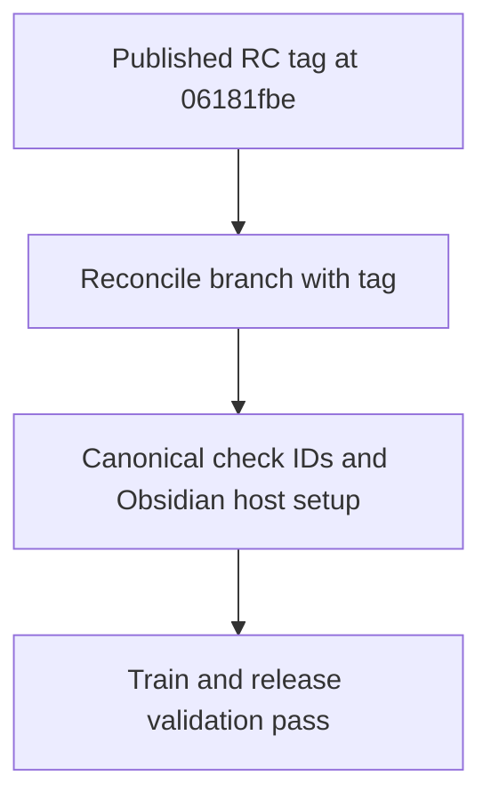

# Instruction: Reconcile train code with the published candidate

## Architecture projection

> Tree of the final files. ✅ create · ✏️ modify · ❌ delete

```txt
.
├── .github/workflows/release.yml ✏️ restore the canonical Obsidian 1.13.7 promotion host setup while retaining verified byte-equality and provenance capture
├── .github/workflows/release-train.yml ✏️ restore the same host setup for the evidence-only route
├── tools/release-train-config.ts ✏️ require the canonical Handbook check IDs from the published provider commit
├── tools/validate-release-train.ts ✏️ align fixture checks and candidate-record equality with the canonical train
└── ❌ none — the published candidate source and archive stay immutable
```

## User Journey



## Test Scope


## Tasks to do

### `1)` Reconcile the two provider histories

> Keep the published tag as the source of candidate identity and make the workflow branch able to promote it.

1. Merge `v8.4.3-rc.1` into the active branch without an automatic merge commit; resolve overlapping source, fixture, and workflow changes to the published candidate's behavior, preserving this folder as the active plan and the tag's task folder as historical context.
2. Verify `06181fbe1e5fc1c33f85d30edfae2e1cb6581db1` is an ancestor of the resulting workflow ref and that ordinary root imports and the explicit browser subpath still pass the packed-package fixtures.
3. Keep the `origin/main` ancestry validator scoped to publishing a new candidate; verify this already published RC through its immutable release metadata, tag target, sidecar, and downloaded bytes in phase 6.

### `2)` Restore the canonical train gate

> Use the check names and real Obsidian host prerequisites that correspond to the published provider source.

1. Require Lantern `vite-build` and `monsterhearts-four-assets`; require Handbook `commonjs-plugin-build` and `obsidian-1.13.7-plugin-load` in protocol-1 evidence and fixture tests.
2. Provision Obsidian 1.13.7 in both train and promote workflows and pass `HANDBOOK_E2E_OBSIDIAN` to the consumer proof runner; preserve candidate download, SHA-256/SRI checks, final-asset equality, and provenance output.
3. Run the repository checks and workflow review, then mark this phase done in the same commit as the reconciliation.

## Test acceptance criteria

| Task | Acceptance criteria |
| --- | --- |
| 1 | The workflow ref descends from the published candidate commit, and the packed CommonJS and Vite fixtures pass without changing the immutable RC. |
| 2 | Both release-train routes supply an Obsidian 1.13.7 executable and require the canonical role-specific artifact check IDs; missing or renamed checks fail validation. |
