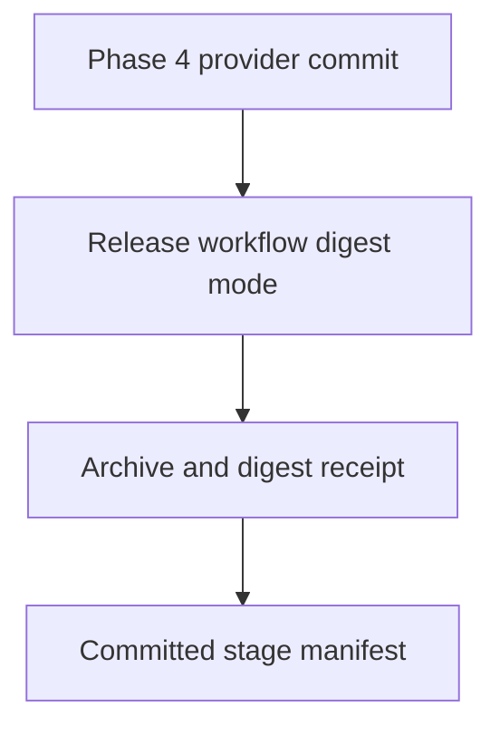
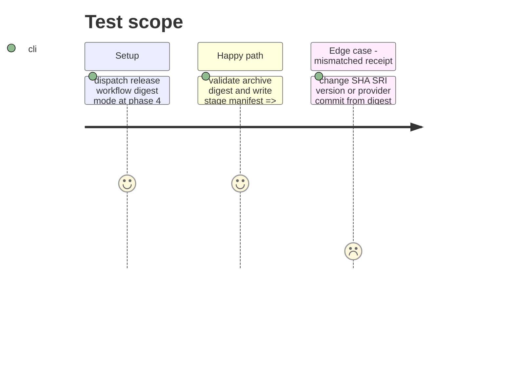

# Instruction: Record the canonical candidate digest

## Architecture projection

> Tree of the final files. ✅ create · ✏️ modify · ❌ delete

```txt
.
├── release-stage.schema-pbta-v8.4.3.json ✅ record the provider SHA, RC URL, SHA-256, SRI, version, and tags from the Ubuntu/Node 24 digest run
└── ❌ none — source files and the provider commit remain unchanged
```

## User Journey



## Test Scope



## Tasks to do

### `1)` Obtain the canonical archive identity

> Produce a digest without publishing an RC or requiring consumer refs.

1. Run `release.yml` in digest mode on its immutable provider commit and download its archive and digest receipt.
2. Verify the receipt's SHA-256 and SRI against the downloaded archive and its provider SHA against the requested commit.

### `2)` Commit the stage manifest

> Give the stage workflow immutable candidate inputs.

1. Create the v8.4.3 stage manifest using the verified digest and unused `v8.4.3-rc.1` tag.
2. Run `validate:release-stage`; mark this phase done and commit the manifest.

## Test acceptance criteria

| Task | Acceptance criteria |
| --- | --- |
| 1 | The non-publishing Ubuntu/Node 24 workflow produces an archive whose recalculated SHA-256 and SRI equal its receipt. |
| 2 | The committed stage manifest names the exact provider commit and archive digest, and its validator passes before staging. |
