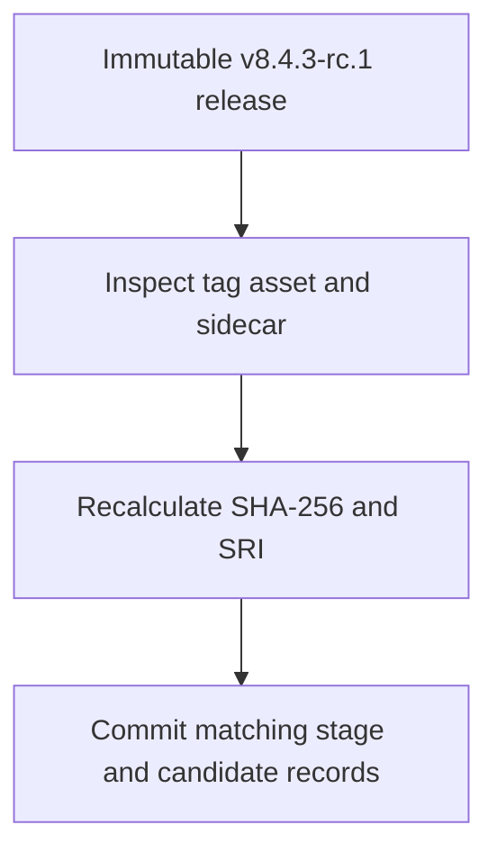
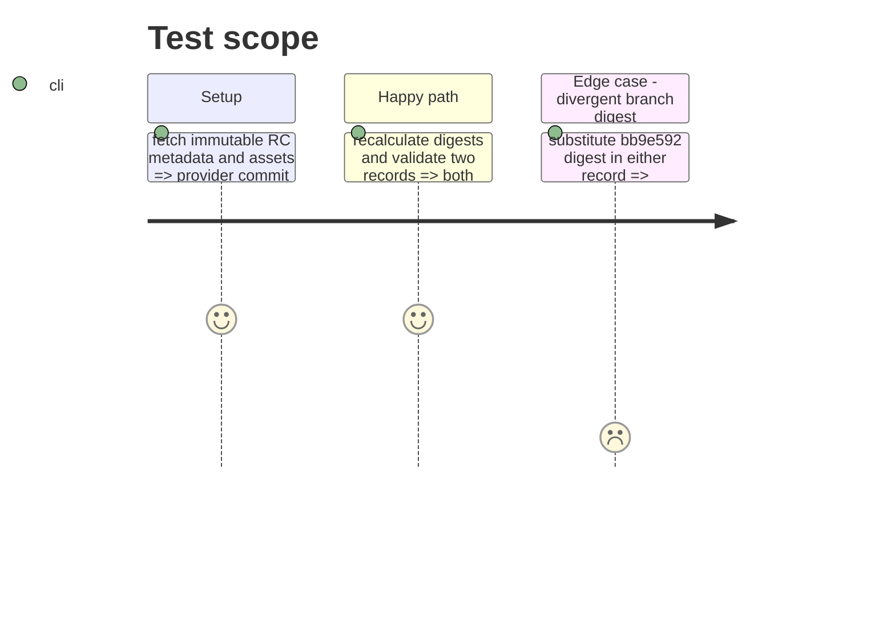

# Instruction: Record the existing immutable candidate

## Architecture projection

> Tree of the final files. ✅ create · ✏️ modify · ❌ delete

```txt
.
├── release-stage.schema-pbta-v8.4.3.json ✅ record the already published RC archive identity
├── release-train/candidates/schema-pbta-v8.4.3-rc.1.json ✅ mirror the verified candidate fields
└── ❌ none — no new candidate tag or staged asset is created
```

## User Journey



## Test Scope



## Tasks to do

### `1)` Verify the published candidate

> Establish the exact identity already consumed by Lantern.

1. Query the immutable `v8.4.3-rc.1` release and tag target; download `schema-pbta-8.4.3.tgz` and its `.sha256` sidecar.
2. Check the sidecar and independently compute SHA-256 `1aa889767d8b737c5c05248099ba79dd9d4c5e32ce99e27927bbafd1ee6b93c4` and SRI `sha512-ZMPKlxqMjZlfkLVQs/ufpGVBDtP9BXpee+C2hFX6ZknNSw7PMDPNIdCTmaXWe525kQouBpsi2HSrH0CguxxYaw==`; validate the downloaded package in CommonJS and Vite fixtures.

### `2)` Commit matching records

> Give the train a durable source of truth without attempting to republish an occupied tag.

1. Write the stage and candidate JSON records with the exact RC URL, digest, SRI, version `8.4.3`, `v8.4.3-rc.1`, `v8.4.3`, and provider commit `06181fbe1e5fc1c33f85d30edfae2e1cb6581db1`.
2. Validate both records and their equality, mark this phase done, and commit them. Do not dispatch `stage`, `digest`, or `publish-candidate` for v8.4.3.

## Test acceptance criteria

| Task | Acceptance criteria |
| --- | --- |
| 1 | GitHub reports an immutable RC targeting `06181fbe...`, and the downloaded archive matches the sidecar, SHA-256, SRI, and packed-package fixtures. |
| 2 | The committed stage and candidate records are identical and name the published `1aa889...` bytes; neither contains the branch-only `bb9e592...` digest. |
