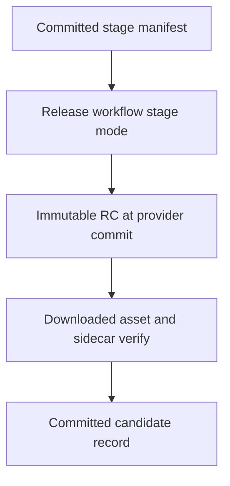
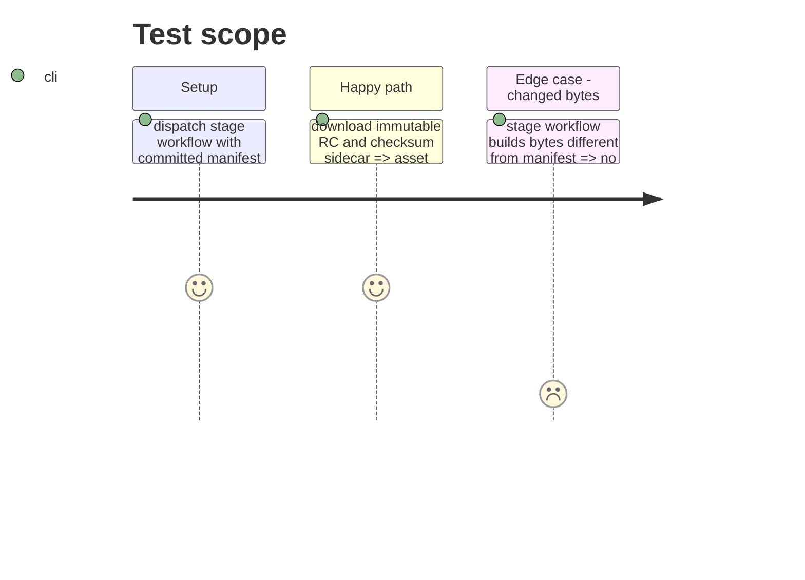

# Instruction: Stage and verify the immutable candidate

## Architecture projection

> Tree of the final files. ✅ create · ✏️ modify · ❌ delete

```txt
.
├── release-train/candidates/schema-pbta-v8.4.3-rc.1.json ✅ record the verified candidate fields after immutable RC publication
└── ❌ none — staging reads the committed phase 5 manifest without rebuilding source from its own commit
```

## User Journey



## Test Scope



## Tasks to do

### `1)` Publish the candidate through the canonical route

> Stage only the bytes named by the committed manifest.

1. Run `release.yml` in stage mode on Ubuntu/Node 24 with the phase 5 manifest and the exact provider SHA.
2. Verify immutable RC metadata, tag target, tarball, sidecar, SHA-256, and SRI through the GitHub release API.

### `2)` Record the verified candidate

> Preserve the candidate identity that consumers must adopt.

1. Write the candidate record from the verified staged asset, mark this phase done, and commit it.

## Test acceptance criteria

| Task | Acceptance criteria |
| --- | --- |
| 1 | The immutable `v8.4.3-rc.1` release targets the phase 4 provider commit and its archive matches the phase 5 manifest exactly. |
| 2 | A committed candidate record identifies the same URL, SHA-256, SRI, version, tags, and provider commit. |
