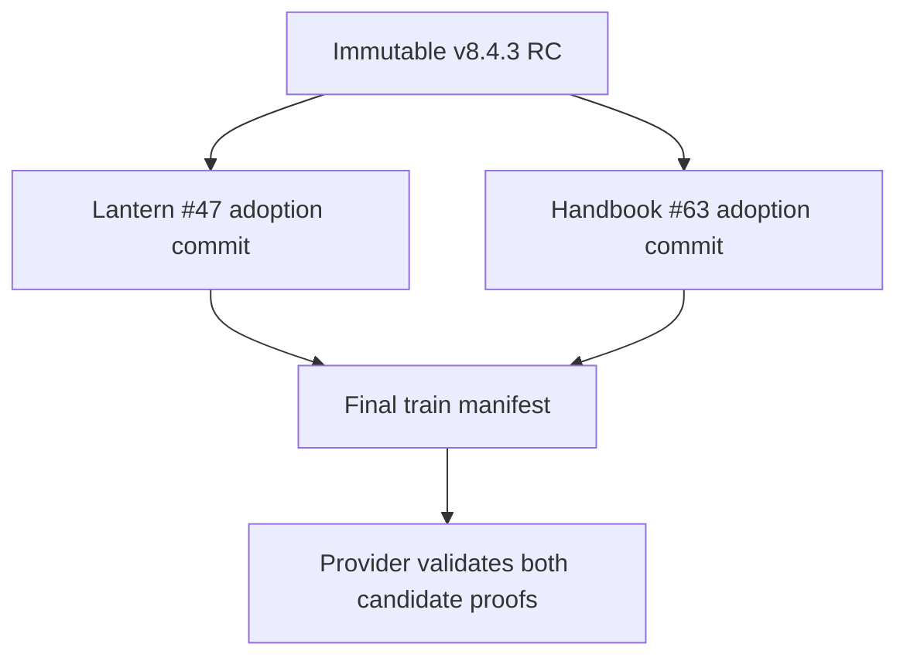
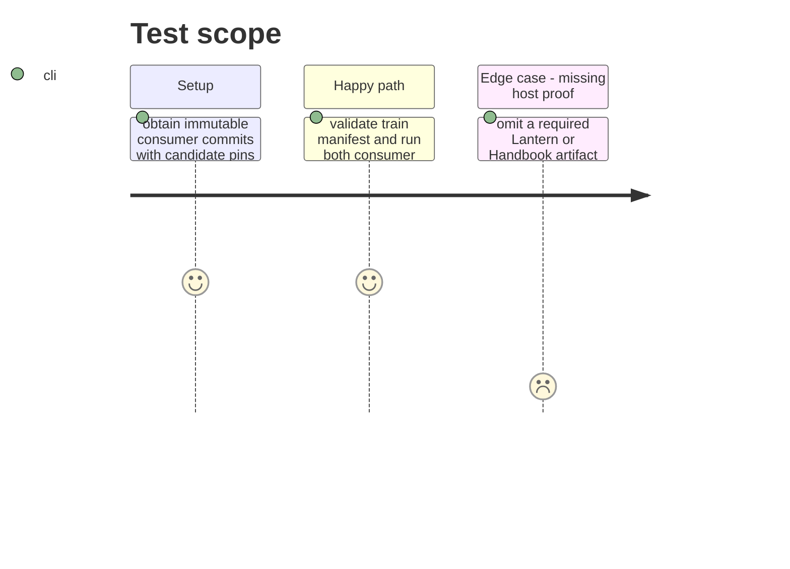

# Instruction: Register immutable consumer adoption

## Architecture projection

> Tree of the final files. ✅ create · ✏️ modify · ❌ delete

```txt
.
├── release-train/schema-pbta-v8.4.3.json ✅ name the staged archive and Lantern and Handbook adoption commits
└── ❌ none — Lantern #47 and Handbook #63 implement their own build and host checks
```

## User Journey



## Test Scope



## Tasks to do

### `1)` Register adoption commits

> Consume consumer-owned proof without changing their repositories here.

1. Wait for Lantern #47's frozen candidate pin and emitted-and-served four-asset evidence at a full commit.
2. Wait for Handbook #63's frozen candidate pin and production-build plus isolated Obsidian 1.13.7 plugin-load evidence at a full commit.
3. Write the final train manifest from those commits and the exact stage candidate fields.

### `2)` Validate and commit the train

> Establish immutable promotion input.

1. Run train validation and consumer assertions against the candidate; verify the required check names and matching SHA-256/SRI.
2. Mark this phase done and commit the manifest.

## Test acceptance criteria

| Task | Acceptance criteria |
| --- | --- |
| 1 | The train manifest names only immutable consumer commits that pin the exact staged archive. |
| 2 | Both consumer proofs pass with Lantern's four-asset check and Handbook's real plugin-load check before the train manifest is committed. |
