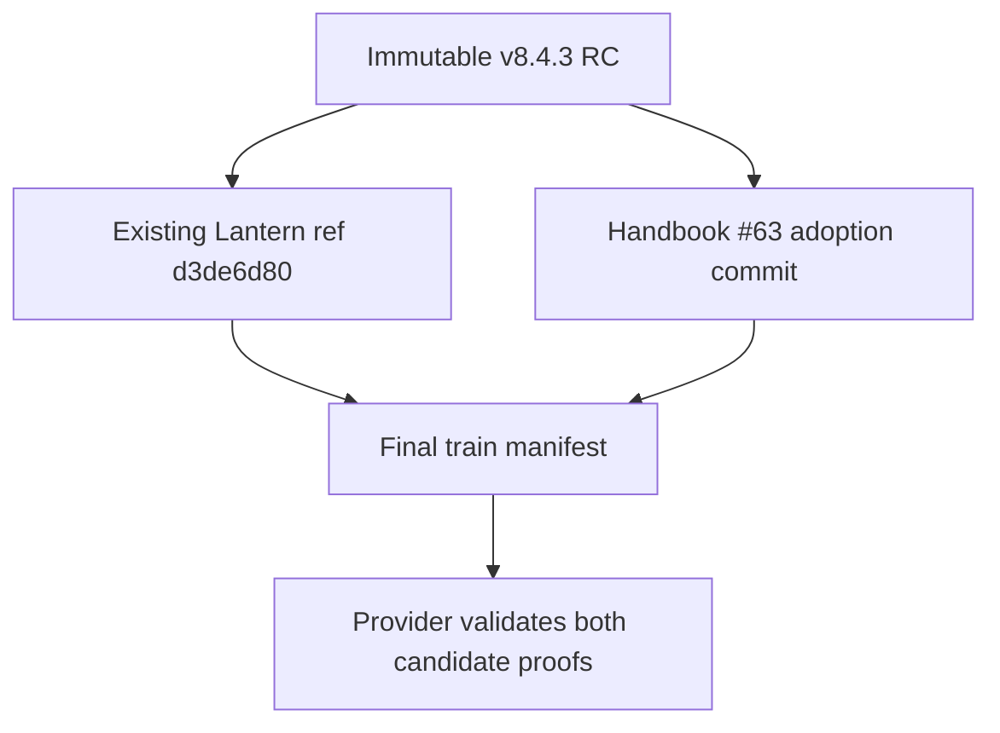
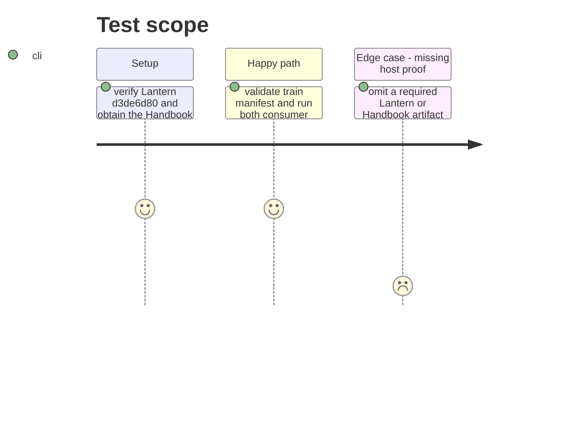

# Instruction: Register immutable consumer adoption

## Architecture projection

> Tree of the final files. ✅ create · ✏️ modify · ❌ delete

```txt
.
├── release-train/schema-pbta-v8.4.3.json ✅ name the existing RC archive and Lantern and Handbook adoption commits
└── ❌ none — Lantern #47 and Handbook #63 implement their own build and host checks
```

## User Journey



## Test Scope



## Tasks to do

### `1)` Register adoption commits

> Consume consumer-owned proof without changing their repositories here.

1. Verify Lantern's existing immutable ref `d3de6d80fcc04f39edd4d733aa8304a6b772b481` still pins the published RC SHA-256/SRI and emits `vite-build` and `monsterhearts-four-assets`.
2. Obtain Handbook #63's immutable ref that pins the same RC and emits `commonjs-plugin-build` and `obsidian-1.13.7-plugin-load` from a real Obsidian 1.13.7 host run.
3. Write the final train manifest from those full commits and the exact phase 6 candidate fields.

### `2)` Validate and commit the train

> Establish immutable promotion input.

1. Run train validation and both consumer assertions against the published RC; verify the required check names, exact SHA-256/SRI, and successful host artifact results.
2. Mark this phase done and commit the manifest.

## Test acceptance criteria

| Task | Acceptance criteria |
| --- | --- |
| 1 | The train manifest names Lantern `d3de6d80...` and an immutable Handbook commit that both pin the published `1aa889...` archive. |
| 2 | Both consumer proofs pass with Lantern's four-asset check and Handbook's `commonjs-plugin-build` and `obsidian-1.13.7-plugin-load` checks before the train manifest is committed. |
