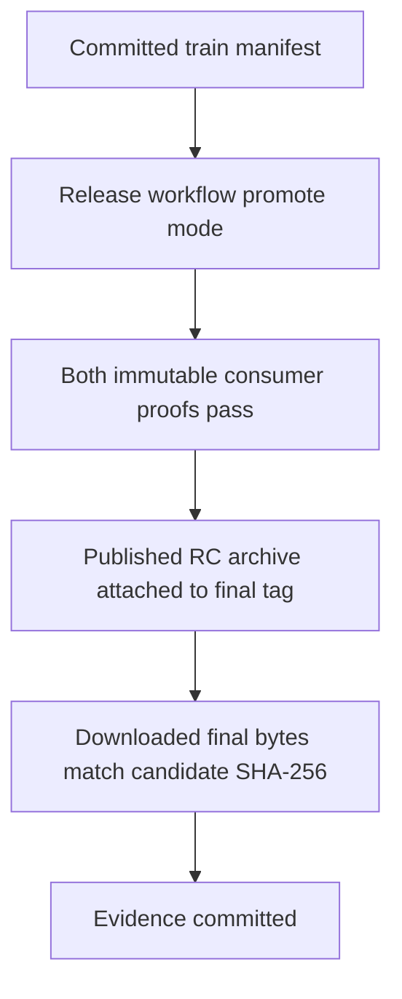
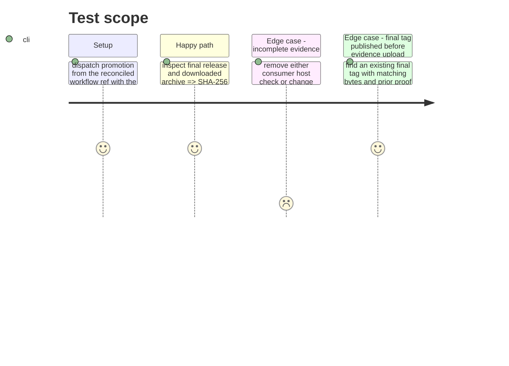

# Instruction: Promote and archive release evidence

## Architecture projection

> Tree of the final files. ✅ create · ✏️ modify · ❌ delete

```txt
.
├── release-train/provenance/schema-pbta-v8.4.3.json ✅ preserve the promotion run's consumer artifact evidence
├── release-train/provenance/schema-pbta-v8.4.3-digests.txt ✅ preserve published RC and final archive SHA-256 equality
└── ❌ none — promotion copies the already staged bytes
```

## User Journey



## Test Scope



## Tasks to do

### `1)` Promote proven bytes

> Publish the exact candidate as the final v8.4.3 asset.

1. Inspect the final `v8.4.3` tag. If absent, run `release.yml` promote mode from the reconciled ref with the committed phase 7 train manifest and provider commit `06181fbe1e5fc1c33f85d30edfae2e1cb6581db1`.
2. Download the final asset and sidecar; compare its target commit, SHA-256, and SRI against the published RC archive and phase 6 records. If the tag already existed, also verify the originating promotion run recorded both passing consumer proofs before publication. Resume evidence capture without republishing only when those facts hold; otherwise stop and report the unsatisfied release criterion.

### `2)` Retain release evidence

> Make host-artifact and byte-identity checks reviewable after the workflow run.

1. Download the workflow's provenance and digest artifacts, or rerun the evidence-only `release-train.yml` workflow and recompute candidate/final digests if publication succeeded before artifact upload. Verify Lantern `vite-build` and `monsterhearts-four-assets`, Handbook `commonjs-plugin-build` and `obsidian-1.13.7-plugin-load`, and equal hashes; save them under `release-train/provenance/`.
2. Mark this phase done and commit its evidence; finalize the plan and record the release result on issue #41 only after all eight phases are done.

## Test acceptance criteria

| Task | Acceptance criteria |
| --- | --- |
| 1 | The immutable final release targets `06181fbe...`, has the published RC's `1aa889...` SHA-256 and SRI, and its promotion run proves both consumer checks passed before publication; an identical pre-existing final tag is verified without another publication attempt. |
| 2 | Versioned provenance names the four canonical host checks alongside equal candidate and final archive digests, including after a partial-publication recovery; issue #41 points to that evidence. |
