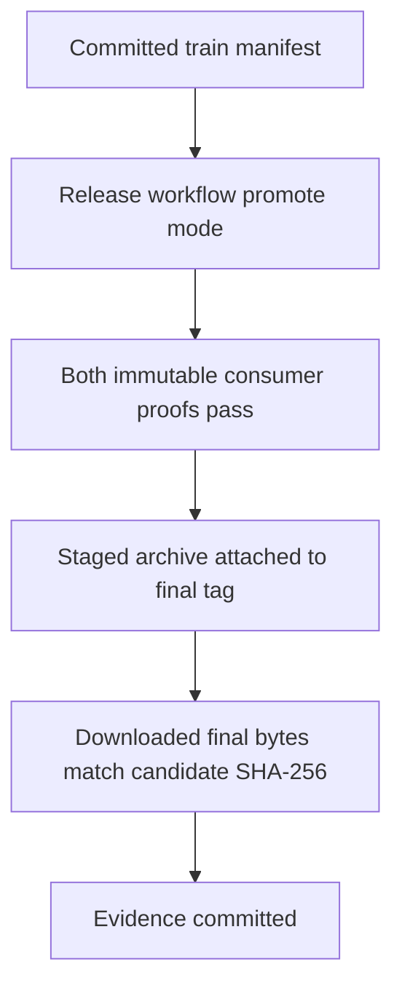
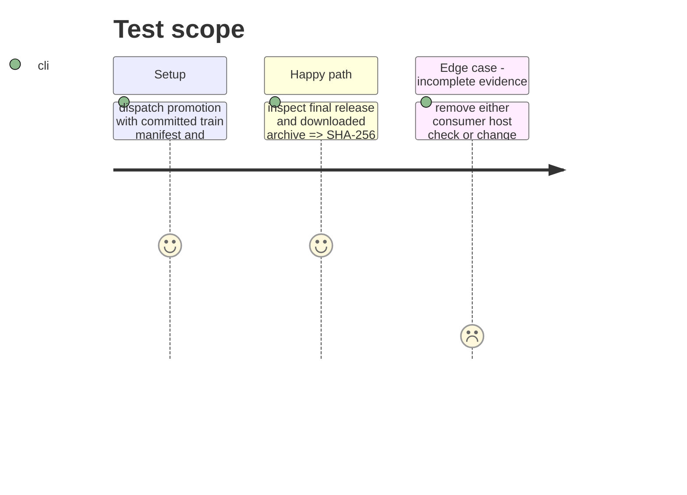

# Instruction: Promote and archive release evidence

## Architecture projection

> Tree of the final files. ✅ create · ✏️ modify · ❌ delete

```txt
.
├── release-train/provenance/schema-pbta-v8.4.3.json ✅ preserve the promotion run's consumer artifact evidence
├── release-train/provenance/schema-pbta-v8.4.3-digests.txt ✅ preserve candidate and final archive SHA-256 equality
└── ❌ none — promotion copies the already staged bytes
```

## User Journey



## Test Scope



## Tasks to do

### `1)` Promote proven bytes

> Publish the exact candidate as the final v8.4.3 asset.

1. Run `release.yml` promote mode with the committed phase 7 train manifest.
2. Download the final asset and compare its SHA-256 and SRI with the staged candidate.

### `2)` Retain release evidence

> Make host-artifact and byte-identity checks reviewable after the workflow run.

1. Download the workflow's provenance and digest artifacts, verify both consumer check lists and equal hashes, and save them under `release-train/provenance/`.
2. Mark this phase done and commit its evidence; finalize the plan only after all eight phases are done.

## Test acceptance criteria

| Task | Acceptance criteria |
| --- | --- |
| 1 | The immutable final release has the exact candidate SHA-256 and SRI, and both consumer proofs passed before publication. |
| 2 | Versioned provenance names Lantern's Vite/four-asset checks and Handbook's production/Obsidian load checks alongside equal candidate and final archive digests. |
